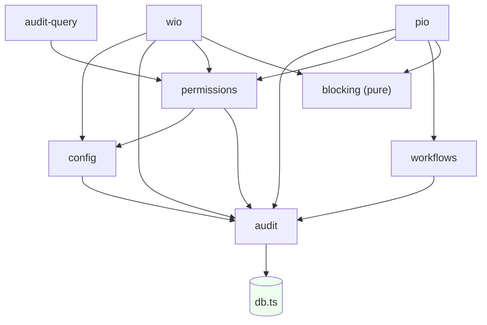

# Dependency Map

Internal module structure and coupling for the RC-1 review. Import edges were
extracted from the source (`@/lib/*` alias); the analysis is measured, not estimated.

**Headline:** clean layered architecture — **zero `lib/ → app/` imports**, **zero
circular dependencies**, high fan-in confined to legitimate cross-cutting utilities.

---

## 1. Layer model (allowed dependency direction)

```
app/api (routes) ─▶ lib/services (domain) ─▶ lib/{db, notifications, auth, ai, integrations}
        │                    │                         │
   middleware.ts        workflow engine           provider slots (external)
        └────────────── never imports upward (verified) ──────────────┘
```

Dependencies point **downward only**. Route handlers depend on services; services
depend on cross-cutting libs and the DB accessor; nothing in `lib/` imports from
`app/`. This keeps the domain layer testable and framework-agnostic.

## 2. Internal module inventory

| Module (`lib/`) | Files | Role | Depends on (internal) |
|---|--:|---|---|
| `services/` | 14 | Domain logic | `db`, `services/*`, `notifications`, `auth` |
| `notifications/` | 13 | Event bus + engine + channels | `db` |
| `auth/` | 10 | Providers, sessions, password, cookie | `db`, `auth/constants` |
| `integrations/keka/` | 6 | Org sync + providers | `db`, `services` |
| `ai/` | 5 | Provider abstraction | (external SDK only) |
| `api/` | 3 | Error mapping, params, request helpers | `zod` |
| `security/` | 1 | Rate limiter | (in-memory) |
| `db.ts` | 1 | `query` / `withUserContext` / `withTransaction` | `pg` |
| `format.ts` | 1 | Document-number & display formatting | — |

## 3. Cross-cutting hubs (fan-in from services)

Import counts from the service layer into shared modules:

| Target | Imports from services | Assessment |
|---|--:|---|
| `@/lib/services/*` (intra-layer) | 34 | expected — see the DAG below |
| `@/lib/notifications` | 28 | single `publishEvent` entry point (healthy) |
| `@/lib/auth` | 28 | session/context resolution (healthy) |
| `@/lib/db` | 23 | the only DB accessor — **by design** |
| `@/lib/integrations` | 10 | Keka sync surface |
| `@/lib/ai` | 7 | single inference entry point |

High fan-in here is **appropriate**: `db`, `audit`, `config`, `permissions`, and
`notifications` are exactly the cross-cutting concerns you *want* centralized behind
one entry point. This is not coupling to reduce — it is the choke-point design working.

## 4. Service dependency graph (intra-`services/`)



Topological order exists (`blocking, audit, config, permissions, workflows, audit-query,
wio, pio`) → **the graph is a DAG**. `audit` and `blocking` are sinks; `db.ts` is the
infrastructure leaf. No module depends back on `wio`/`pio`.

## 5. Circular dependencies

**None found.** Verified two ways:
- No `lib/ → app/` edges (would be the classic route↔service cycle) — grep returned empty.
- The intra-service graph (§4) admits a topological ordering — no back-edges.

## 6. High-coupling areas

- **`db.ts`** — imported by ~23 service sites. Intentional: it is the *only* sanctioned
  DB path (enforces RLS via `withUserContext`). Centralization here is a feature, not debt.
- **`wio.ts`** (581 lines) — the largest module and the widest service (imports config,
  audit, permissions, blocking, notifications). It concentrates the §29/§30 gate logic,
  the clock, and conversion. Not a coupling problem, but a **size** one (see §7).
- **`audit` / `config` / `permissions`** — high fan-in cross-cutting utilities; correct
  by design.

## 7. Refactoring opportunities

Minor and optional — none are blockers:

| Opportunity | Rationale | Effort |
|---|---|---|
| Split `wio.ts` (581 lines) | Separate read/query helpers from mutations if it grows further; only file >500 lines in app code | S |
| Dashboard reads via events (TD-11) | `dashboard.ts` queries modules directly; event-sourcing would remove duplicated read logic | M |
| Extract a shared `services/base` for the audit+permission+context preamble | `wio`/`pio` repeat the same `requirePermission` + `writeAudit` + `withUserContext` scaffolding; a helper would DRY it | S |

Nothing here rises above "nice to have." The dependency structure is healthy and
ready to extend: new modules plug in at the service layer, depend downward on the same
cross-cutting hubs, and inherit the RBAC/RLS/audit/event machinery for free.
