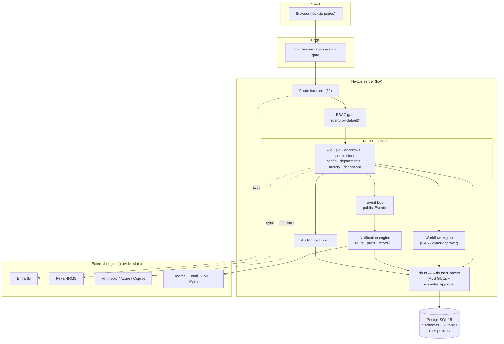
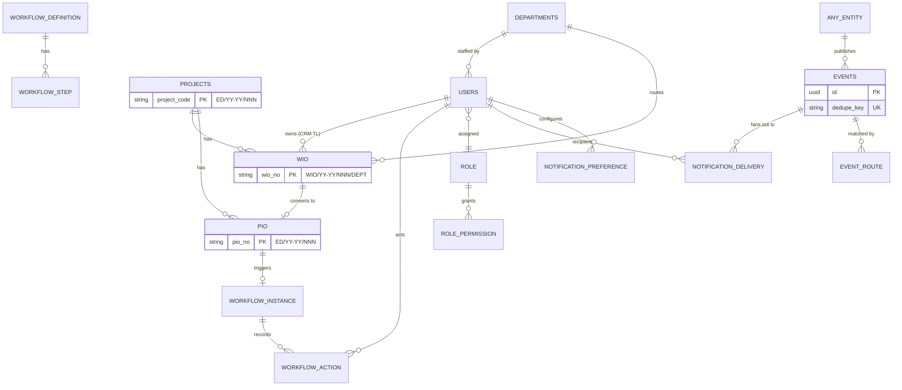
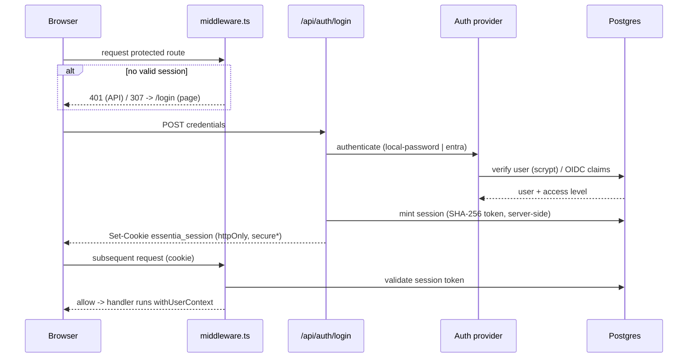
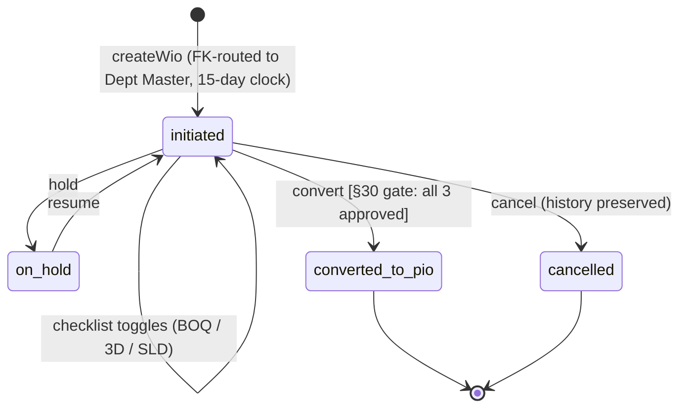
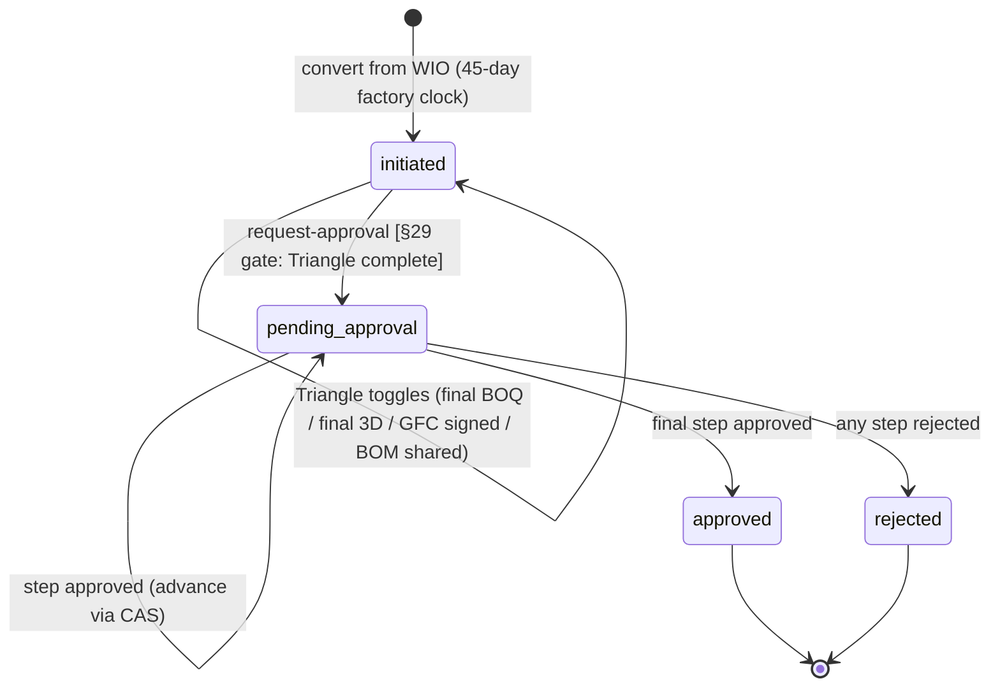
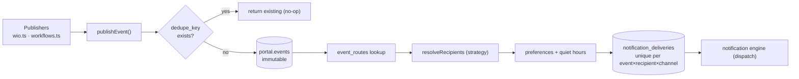
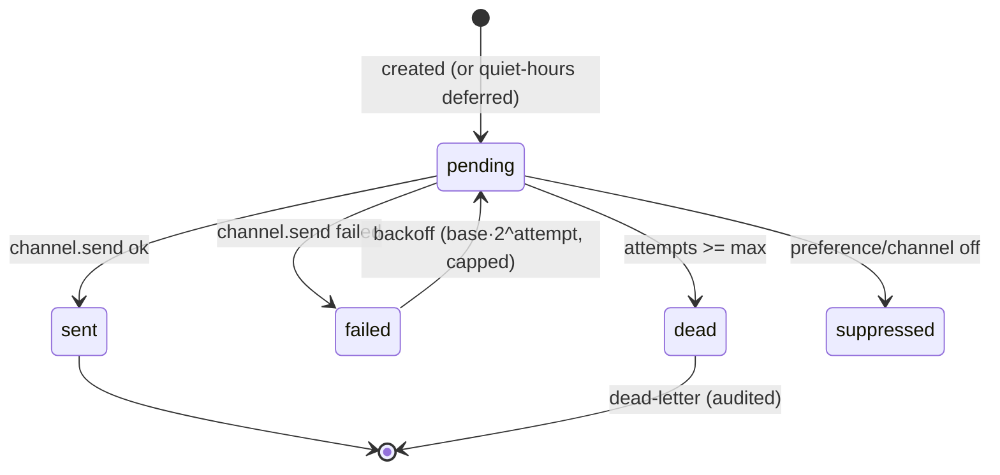
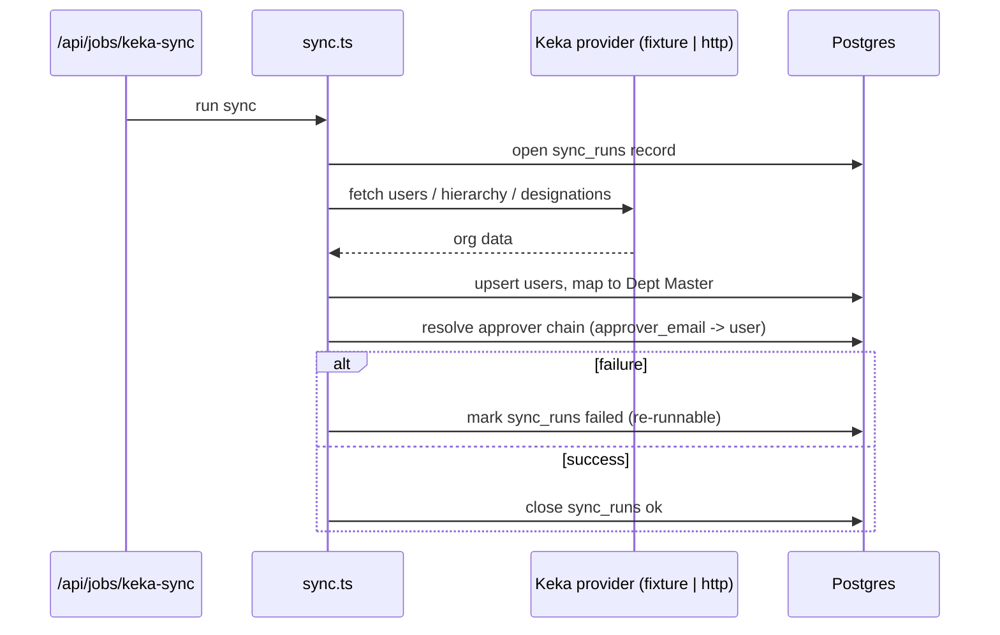
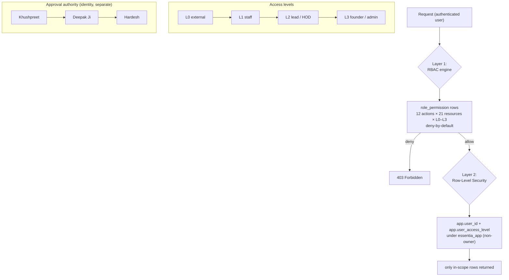
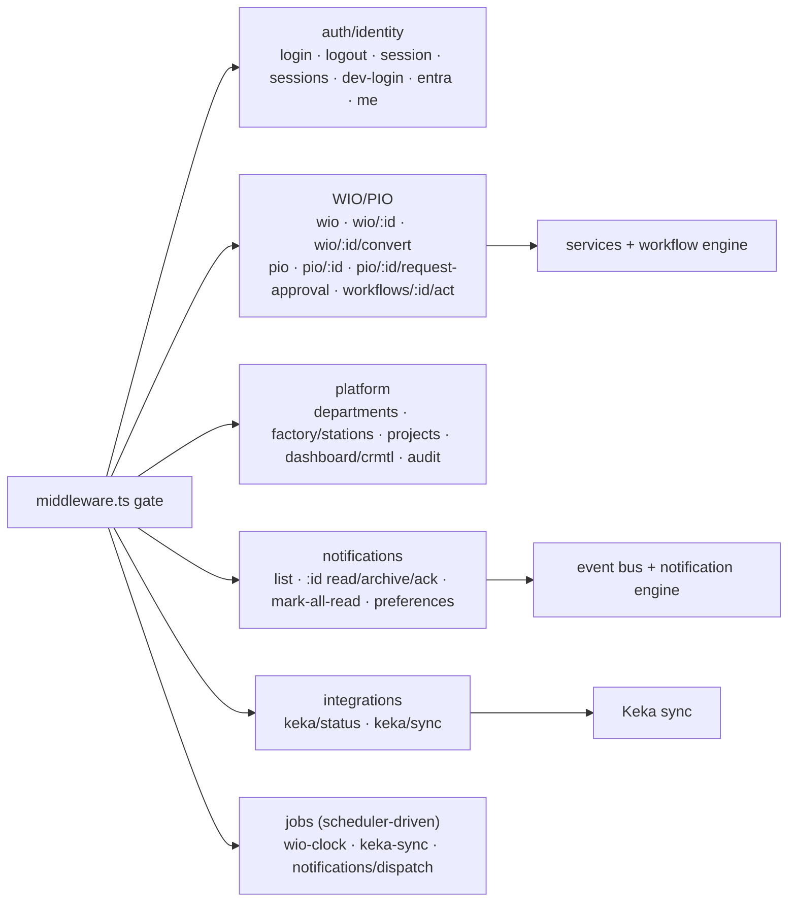

# Architecture Diagrams

Self-contained Mermaid diagrams for the RC-1 review. These render in GitHub and most
Markdown viewers. Subsystem docs carry additional detail; this file is the single
visual reference.

Index: [System](#1-overall-system-architecture) · [Database](#2-database-relationships) ·
[Auth](#3-authentication-flow) · [WIO](#4-wio-lifecycle) · [PIO](#5-pio-lifecycle) ·
[Event Bus](#6-event-bus) · [Notifications](#7-notification-flow) · [Keka](#8-keka-sync) ·
[RBAC](#9-rbac-hierarchy) · [API](#10-api-layer)

---

## 1. Overall System Architecture

## 2. Database Relationships

Golden-thread core (`project_code` links everything). Full schema in
[database.md](database.md).

## 3. Authentication Flow

## 4. WIO Lifecycle

## 5. PIO Lifecycle

## 6. Event Bus

## 7. Notification Flow

Channels: in-app (live) · Teams / email (code-complete, credential-gated) ·
WhatsApp / SMS / Push (prepared slots). Driven by `POST /api/jobs/notifications/dispatch`.

## 8. Keka Sync

## 9. RBAC Hierarchy

## 10. API Layer

32 route handlers, all behind the middleware gate + RBAC. Grouped by domain
([api-catalogue.md](api-catalogue.md) has the full table).

