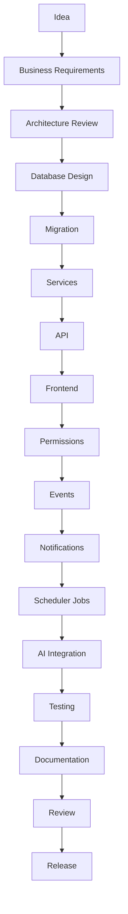

# Module Development Guide (MDG v1.0)

> **The mandatory engineering handbook.** Every developer and AI agent building any module
> of the Essentia Portal **MUST** follow this guide. Where the
> [Platform Architecture Specification (PAS)](PLATFORM_ARCHITECTURE_SPECIFICATION.md)
> defines the architectural *rules*, this document defines the development *process* —
> the ordered steps, structure, and checklists that turn a requirement into a
> production-ready module.
>
> **Language:** RFC-2119 — **MUST** / **MUST NOT** are non-negotiable; **SHOULD** is a
> strong default; **MAY** is optional. A module that fails any MUST **does not merge**.
>
> Ratified against baseline `v0.1-platform-foundation`, PAS v1.0 · 2026-07-08.

**Contents:** [1 Purpose](#1-purpose) · [2 Lifecycle](#2-module-lifecycle) ·
[3 Folders](#3-standard-folder-structure) · [4 Database](#4-database-requirements) ·
[5 Backend](#5-backend-requirements) · [6 Frontend](#6-frontend-requirements) ·
[7 Workflow](#7-workflow-requirements) · [8 Events](#8-event-requirements) ·
[9 Scheduler](#9-scheduler-requirements) · [10 Notifications](#10-notification-requirements) ·
[11 AI](#11-ai-integration-requirements) · [12 Testing](#12-testing-requirements) ·
[13 Docs](#13-documentation-requirements) · [14 Security](#14-security-checklist) ·
[15 Performance](#15-performance-checklist) · [16 PR Checklist](#16-pull-request-checklist) ·
[17 Review](#17-code-review-checklist) · [18 DoD](#18-definition-of-done) ·
[19 Release](#19-release-checklist) · [20 Future Modules](#20-future-modules)

---

## 1. Purpose

**Why this document exists.** The platform has reached the point where the largest risk is
no longer missing features — it is inconsistency and knowledge loss. This guide makes the
build process repeatable: any competent team, human or AI, can produce a correct module by
following it, and every module comes out shaped the same way — secure, audited, tested,
documented, and inheriting the foundation rather than re-inventing it.

**Relationship with the other governance documents (read in this order):**

| Document | Answers | Role |
|---|---|---|
| [SYSTEM_OVERVIEW.md](../../SYSTEM_OVERVIEW.md) | *What is this system?* | Orientation — read first |
| [PAS](PLATFORM_ARCHITECTURE_SPECIFICATION.md) | *What are the rules?* | The architectural contract (constraints, ADRs) |
| **MDG (this doc)** | *How do I build a module?* | The development process (steps, structure, checklists) |
| [RUNBOOK.md](../../RUNBOOK.md) | *How do I run / test / deploy it?* | Operational commands |

The MDG **MUST NOT** contradict the PAS. Where this guide says "MUST," it is either
restating or operationalizing a PAS rule. If a conflict is ever found, the PAS wins and
the MDG is corrected.

---

## 2. Module Lifecycle

Every module **MUST** pass through these stages in order. Each stage has an **exit
criterion** that gates the next.



| Stage | What happens | Exit criterion |
|---|---|---|
| **Idea** | A capability is proposed against the North Star. | It plausibly makes "every client returns" more true. |
| **Business Requirements** | The relevant Brief section(s) are read; rules, gates, and the 4-part build spec (module, visuals, blocking rules, acceptance test) are captured. | Requirements + acceptance test written down. |
| **Architecture Review** | The design is checked against the PAS: layers, ADRs, what it reuses vs. adds. | Design conforms to PAS; new permanent decisions proposed as ADRs. |
| **Database Design** | Tables, keys, constraints, RLS, audit implications designed **first**. | Schema reviewed; golden-thread FKs identified. |
| **Migration** | A new forward-only migration authored (§4). | `db/validate.mjs` loads it clean. |
| **Services** | All business logic + the guarded-mutation pattern (§5). | Logic complete; no rules in routes. |
| **API** | Thin route handlers, validation, error mapping (§5). | Routes call one service fn; errors mapped. |
| **Frontend** | Pages + components + all UI states (§6). | Brand-compliant, permission-aware, responsive. |
| **Permissions** | `role_permission` rows; RLS policy (§4/§14). | Deny-by-default verified under `essentia_app`. |
| **Events** | Domain events published for state changes (§8). | Events named, deduped, audited. |
| **Notifications** | `event_routes` map events → recipients/channels (§10). | No direct sends; routes seeded. |
| **Scheduler Jobs** | Any background work authored as a job route to the PAS §6 contract (§9). | Idempotent; ready to schedule. |
| **AI Integration** | If AI is used, via the provider abstraction with guardrails (§11). | Human approval points in place; explainable. |
| **Testing** | All applicable test tiers (§12). | Green: harness, unit, typecheck, lint, build, E2E. |
| **Documentation** | Deep-dive, API, assumptions, changelog, traceability (§13). | Docs merged with the code. |
| **Review** | PR + code-review checklists (§16/§17). | All boxes checked by author and reviewer. |
| **Release** | Release checklist (§19). | Deployment approved. |

**Architecture Review is a hard gate.** No migration is written before the design has
been checked against the PAS.

---

## 3. Standard Folder Structure

A module named `<module>` (e.g. `boq`, `procurement`) **MUST** place its artifacts as
follows, mirroring the existing repo layout exactly. New shared infrastructure (e.g. the
scheduler) lives under `lib/` when built.

```
db/
  0NN_<module>.sql            # one new numbered migration (flat, ordered — NOT edited later)

frontend/
  lib/
    services/
      <module>.ts             # ALL business logic for the module + RBAC gate
    notifications/            # (shared) events published via publishEvent(); no per-module fork
    scheduler/                # (shared, when built) auto-pilot; module adds a job ROUTE, not engine code
    ai/                       # (shared) provider abstraction; module adds prompt templates only
  app/
    api/
      <module>/               # thin route handlers (route.ts) behind the middleware gate
      jobs/<module>/          # background job route(s), if any (idempotent)
    (portal)/<module>/        # pages: page.tsx + loading.tsx + error.tsx
  components/
    <module>/                 # reusable UI for the module
  tests/
    unit/                     # vitest units (logic, rendering)
    e2e/                      # HTTP-only flow scripts on an isolated prod-mode stack

docs/
  <module>.md                 # the module deep-dive
  architecture/               # update diagrams, traceability, api-catalogue as affected
```

**Folder responsibilities:**

| Location | Responsibility | MUST NOT |
|---|---|---|
| `db/0NN_<module>.sql` | Schema for the module; immutable once shipped | be edited after release; reuse a number |
| `lib/services/<module>.ts` | Business logic, gates, audit, event emission | live in routes; open its own DB client |
| `app/api/<module>/**` | HTTP surface: validate, call service, map errors | contain business rules |
| `app/api/jobs/<module>/**` | Background job endpoints (idempotent) | hold state between runs |
| `app/(portal)/<module>/**` | Pages, deep-linkable, all states | fetch services directly (uses API) |
| `components/<module>/**` | Reusable presentation | embed permission or business logic |
| `tests/**` | Proof of correctness at every tier | be skipped for "small" changes |
| `docs/<module>.md` | The authoritative module reference | drift from the code |

> Note: migrations are **flat numbered files in `db/`** (`001_…`, `002_…`, `004_…`), not a
> `db/migrations/` subfolder — follow the existing convention. Events are published through
> the shared `lib/notifications` layer; a module never forks its own delivery pipeline.

---

## 4. Database Requirements

Every module that persists data **MUST** define, in its migration:

- **Migration** — one new file `db/0NN_<module>.sql`, the next free number (never reuse;
  `003` stays a gap). Forward-only and **idempotent** (safe to re-apply).
- **Indexes** — on every FK and every column used in a `WHERE`/`ORDER BY` on a hot path.
- **Foreign keys** — to the **golden thread** (`project_code` / owning entity) and to
  `public.users`/`departments` as applicable. Orphan rows are not allowed.
- **Constraints** — `NOT NULL`, `CHECK`, and `UNIQUE` to make illegal states
  unrepresentable. Money/gate fields (e.g. the 20% coordination charge) **MUST** be
  generated columns or constrained so they cannot be tampered with.
- **RLS** — any user- or department-scoped table **MUST** carry an RLS policy reading the
  `app.user_id` / `app.user_access_level` GUCs, and **MUST** be verified under the
  non-owner `essentia_app` role (Postgres skips RLS for owners — ADR-003).
- **Audit implications** — state which mutations are auditable (all of them) and whether
  the table itself is append-only.

**Immutable migration policy (MUST).** A released migration is **never edited**. Corrections
ship as a **new** migration. Migrations are ordered and idempotent; the harness
(`npm run validate`) **MUST** load the full set clean before the migration is considered
done. Dev-only data lives in `900_*` and **MUST NOT** run in production (ADR-010).

---

## 5. Backend Requirements

Every module **MUST** include:

- **Service layer** (`lib/services/<module>.ts`) — all business logic. Routes hold none.
- **API routes** (`app/api/<module>/**`) — thin; one service call each.
- **Validation** — every input parsed/validated (zod) at the boundary; reject early.
- **Permission checks** — every operation begins with `requirePermission(action, resource)`
  (deny-by-default). Checks live in the **service**, so all callers are covered.
- **Audit logging** — every mutation calls `writeAudit(...)` through the single choke point.
- **Events** — every state change others care about is published via `publishEvent()` (§8).
- **Notifications** — delivered by seeding `event_routes`, never by calling a channel (§10).
- **Error handling** — throw typed domain errors; map to HTTP **only** in
  `lib/api/errors.ts`. 4xx = caller fault, **409** = concurrency/gate conflict, 5xx = real
  fault. Never leak internals.

**The guarded-mutation pattern (MUST) — every mutation follows this shape:**

```
requirePermission(action, resource)        // 1. RBAC gate (deny-by-default)
  → withUserContext(user, async () => {    // 2. RLS scope + transaction
        ... perform the change ...
        writeAudit(...)                     // 3. immutable audit
        publishEvent(...)                   // 4. domain event (if state changed)
     })
```

No mutation may skip step 1, 2, or 3. This is the module's inheritance of the foundation.

---

## 6. Frontend Requirements

Every module with UI **MUST** include:

- **Pages** — under `app/(portal)/<module>/`, deep-linkable, using the app shell.
- **Reusable components** — under `components/<module>/`; no business logic embedded.
- **Loading states** — a `loading.tsx` (or skeleton) for every async surface.
- **Empty states** — a clear, branded empty state (never a blank screen).
- **Error states** — an `error.tsx` boundary with a recovery path; no raw errors shown.
- **Permissions** — actions/nav render according to the user's level; the UI **MUST NOT**
  be the only gate (the API enforces too), but it MUST NOT offer actions the user can't do.
- **Responsive behaviour** — usable on the target viewports.

**Brand (MUST):** Cold-Coffee palette; Cormorant Garamond headings + Lato body; logo as an
image, never text. **Vocabulary (MUST NOT):** never "studio", "handover", "complaint",
"deliverable" — use essentia/vertical, Day of Recognition, concern/feedback, milestone
(ADR-012).

---

## 7. Workflow Requirements

If the module contains an approval or multi-step process, it **MUST** use the generic
workflow engine (never bespoke approval code) and define:

- **State machine** — `pending → approved | rejected | cancelled` with `current_step`;
  terminal states immutable.
- **Approvals** — advance via **compare-and-swap**; each step bound to an **exact
  approver** (identity from Keka), 403 for the wrong person, 409 for unresolved.
- **SLA** — per-step SLA duration (data); breaches emit `workflow.sla_breached`.
- **Escalation** — a defined ladder via events (e.g. AR §36 45/60/90-day), never hardcoded.
- **Audit** — every action (approve/reject/delegate) recorded and attributable.
- **Retry** — decisions are user actions (not retried); their side effects inherit
  delivery retry (§10).
- **Notifications** — step transitions publish events that route to the right approver.

See [PAS §4](PLATFORM_ARCHITECTURE_SPECIFICATION.md#4-workflow-standards) and
[workflows.md](workflows.md).

---

## 8. Event Requirements

Every business action that others may react to **MUST** define:

- **Event name** — `domain.action`, lowercase, past-tense (e.g. `boq.approved`). Never
  overload an existing name.
- **Payload** — minimal JSON: IDs + `entity_ref` (the human number), no whole rows, no
  secrets/PII beyond entitlement. Consumers tolerate unknown fields.
- **Recipients** — expressed as an `event_routes` recipient strategy (explicit / actor /
  project_tl / workflow_step_approver …), not hardcoded addresses.
- **Dedupe key** — set for any event that could be published more than once (time-bucketed
  for periodic events); enforced by the partial unique index.
- **Audit** — events are insert-only and attributable (`actor_id`, `correlation_id`).
- **Versioning** — additive changes only; a breaking change is a new name (`_v2`).

See [PAS §5](PLATFORM_ARCHITECTURE_SPECIFICATION.md#5-event-standards).

---

## 9. Scheduler Requirements

*(The scheduler/auto-pilot is not yet built — see
[INFRA_GAP_ANALYSIS.md](INFRA_GAP_ANALYSIS.md) IG-06. Author job routes to this contract
now; they are wired to a cadence when the scheduler lands.)*

When a module needs background work, define:

- **Job** — an **idempotent** HTTP route under `app/api/jobs/<module>/` (re-running it
  MUST be safe). The job holds no state between runs.
- **Schedule** — the cadence as **data** (cron expression / interval), not code.
- **Retry** — bounded exponential backoff to a max, then park + alert.
- **Locking** — one instance fires per scheduled tick (advisory lock / leased row); no
  double-firing under horizontal scale.
- **Monitoring** — expose last-run time, duration, status; a missed tick alerts.
- **Failure handling** — a failed run **MUST NOT** wedge the schedule; it logs, alerts,
  and the next tick proceeds.

See [PAS §6](PLATFORM_ARCHITECTURE_SPECIFICATION.md#6-scheduler-standards).

---

## 10. Notification Requirements

Every notification the module produces **MUST** specify (as data, via `event_routes` +
templates — never as direct channel calls):

- **Trigger** — the domain event that produces it.
- **Recipients** — the recipient strategy.
- **Channels** — from the allowed set (in-app always available; Teams/email/SMS/push per
  config). The module names **none** of them in code.
- **Template** — per-channel rendering from event vars; unit-tested even when the channel
  is credential-gated.
- **Preferences** — honoured by the engine (channel opt-ins, category mutes).
- **Quiet hours** — interruptive channels deferred; urgent bypasses; in-app floor.
- **Retry** — exponential backoff to `max_attempts`.
- **Dead-letter** — exhausted retries → `dead` + audit record; never silently dropped.

Delivery is **at-least-once** per (event × recipient × channel). See
[PAS §7](PLATFORM_ARCHITECTURE_SPECIFICATION.md#7-notification-standards).

---

## 11. AI Integration Requirements

If the module uses AI, it **MUST**:

- **Provider abstraction** — call only `lib/ai` (never a vendor SDK directly); model choice
  is configuration.
- **Prompt template** — from the versioned, modular prompt library; no inline prompt
  strings.
- **Explainability** — record model, prompt version, inputs, and output in the audit trail
  so any suggestion is reconstructable.
- **Approval points** — every client-facing or money-moving output has an explicit human
  gate (e.g. Communication Spine scroll-to-send).
- **Audit** — as above; AI-influenced decisions are attributable.
- **Knowledge sources** — retrieval via the pgvector Knowledge Library, with **attributable
  citations**.

**AI MUST NOT make autonomous business decisions** or take irreversible/outward-facing
actions without a human gate (ADR-013). See
[PAS §8](PLATFORM_ARCHITECTURE_SPECIFICATION.md#8-ai-standards).

---

## 12. Testing Requirements

A module **MUST** include the applicable tiers below. Coverage is **risk-weighted**: gates,
money, and identity get the deepest testing.

| Tier | Mechanism in this repo | MUST cover |
|---|---|---|
| **Unit** | vitest (`tests/unit`) | pure logic, formatting, edge cases |
| **Integration** | db harness (`db/validate.mjs`) | service ↔ DB behaviour, constraints |
| **Workflow** | db harness | CAS advance, exact-approver, rejection, SLA |
| **Permission** | db harness + E2E | deny-by-default; each level; RLS scoping |
| **Event** | db harness | routing, dedupe, immutability |
| **Notification** | db harness + vitest | delivery states, dead-letter, template render |
| **API** | HTTP E2E (`tests/e2e`) | status codes, validation, error mapping |
| **UI** | vitest render tests | components render; states present |
| **E2E** | HTTP-only on isolated prod-mode stack | the primary end-to-end flow |
| **Regression** | existing harness + E2E must stay green | no prior behaviour broken |

**Green bar (MUST):** `db` harness, vitest, `typecheck`, `lint`, and `build` all pass, and
the module's E2E passes, before Review. Commands: [RUNBOOK §5](../../RUNBOOK.md#5-running-tests).

---

## 13. Documentation Requirements

Every module **MUST** produce/update:

- **Architecture document** — `docs/<module>.md` (the deep-dive: model, flows, gates,
  decisions).
- **User guide** — how the intended role uses the module (screens, actions, states).
- **API documentation** — new routes added to
  [api-catalogue.md](api-catalogue.md) (path, auth, request/response, errors).
- **Assumptions** — any non-obvious decision recorded in
  [ASSUMPTIONS_DECISIONS.md](../ASSUMPTIONS_DECISIONS.md) (A-series); permanent decisions
  proposed as ADRs in the PAS.
- **Changelog** — schema changes in [db/CHANGELOG.md](../../db/CHANGELOG.md); module changes
  noted. The [traceability matrix](TRACEABILITY_MATRIX.md) and affected
  [diagrams](DIAGRAMS.md) updated.

Documentation ships **with** the code in the same PR — never "later."

---

## 14. Security Checklist

Every module **MUST** satisfy (how it is met in this platform):

- ☐ **Authentication** — protected routes behind the middleware session gate.
- ☐ **Authorization** — `requirePermission` on every operation, in the service.
- ☐ **RBAC** — `role_permission` rows, deny-by-default; no implicit grants.
- ☐ **RLS** — policy on user/department-scoped tables; verified under `essentia_app`.
- ☐ **Audit** — every mutation through `writeAudit`; immutable trail.
- ☐ **Secrets** — none in code or git; read from env/secrets manager; provider slots fail loud.
- ☐ **Validation** — all input validated (zod) at the boundary.
- ☐ **Rate limiting** — sensitive endpoints throttled (login pattern; broaden per §15/IG-11).
- ☐ **Injection protection** — parameterized SQL only; never string-built queries.
- ☐ **XSS** — no `dangerouslySetInnerHTML` with untrusted data; framework escaping intact.
- ☐ **CSRF** — state-changing routes protected (same-site cookies; token where applicable).
- ☐ **File validation** — uploads (e.g. VisionCAM) validated for type/size/content before storage.

---

## 15. Performance Checklist

- ☐ **Database** — normalized where it matters; generated columns for derived values.
- ☐ **Queries** — parameterized; no N+1; only needed columns selected.
- ☐ **Indexes** — on FKs and hot filters/sorts; partial indexes where selective.
- ☐ **Pagination** — list endpoints paginate; no unbounded result sets.
- ☐ **Caching** — cache hot, rarely-changing reads (dashboard signals) where justified.
- ☐ **Events** — payloads minimal; publish is non-blocking to the user path.
- ☐ **Notifications** — delivery is async/retryable; never in the request critical path.
- ☐ **Scheduler** — jobs bounded, idempotent, and locked; no overlapping runs.
- ☐ **API response time** — primary reads meet the target budget; measured, not assumed.

---

## 16. Pull Request Checklist

The **author MUST** complete before requesting review:

- ☐ Migration created (forward-only, idempotent, harness loads clean)
- ☐ Services complete (all logic; guarded-mutation pattern; no rules in routes)
- ☐ APIs documented (added to the API catalogue; validation + error mapping)
- ☐ Events published (named, deduped, audited)
- ☐ Notifications configured (`event_routes` seeded; no direct sends)
- ☐ Permissions verified (deny-by-default rows; RLS under `essentia_app`)
- ☐ Audit verified (every mutation writes an immutable record)
- ☐ Scheduler jobs idempotent (if any) and authored to the §9 contract
- ☐ AI guardrails + human approval points in place (if AI used)
- ☐ Tests passing (harness, unit, typecheck, lint, build, E2E — all green)
- ☐ Documentation updated (deep-dive, API, assumptions, changelog, traceability)
- ☐ Security + performance checklists (§14/§15) satisfied
- ☐ Brand + vocabulary compliant; all UI states present
- ☐ **No TODOs / FIXME / `any` / `@ts-ignore` / `eslint-disable`**
- ☐ Branched off the baseline; conventional commits; no secrets committed
- ☐ **Production ready** (release checklist §19 considered)

---

## 17. Code Review Checklist

The **reviewer MUST** verify:

- **Architecture** — conforms to the PAS (layers, ADRs); reuses the foundation, doesn't
  re-implement it; dependencies point downward only.
- **Security** — §14 satisfied; permission checks in the service; RLS present; no secrets;
  parameterized SQL.
- **Performance** — §15 satisfied; no obvious N+1, unbounded queries, or blocking side
  effects in the request path.
- **Readability** — reads like its neighbours (naming, structure, comment density); no
  cleverness that obscures intent.
- **Maintainability** — no dead code, no needless duplication; module boundaries clean.
- **Documentation** — accurate and shipped with the code; diagrams/traceability updated.
- **Testing** — the right tiers present; risk-weighted; green; regression suite intact.
- **Business rules** — every applicable permanent constraint (ADR-011) enforced with the
  exact required behaviour and message.

A reviewer **MUST** block a PR that fails any MUST above, regardless of deadline.

---

## 18. Definition of Done

A module is **Done** — and may be released — **only if ALL** of the following hold:

1. **Module Contract complete** — all 10 artifacts exist
   ([PAS §3](PLATFORM_ARCHITECTURE_SPECIFICATION.md#3-module-contract)): migration,
   services, API, UI, tests, documentation, events, notifications, audit, permissions.
2. **Every mutation is guarded** — RBAC → RLS → audit → event.
3. **All applicable test tiers pass** (§12); the full green bar is green; regression intact.
4. **All checklists satisfied** — security (§14), performance (§15), PR (§16), review (§17).
5. **Documentation merged with the code** (§13).
6. **Every applicable permanent constraint enforced** (ADR-011), with exact behaviour/message.
7. **No suppressed quality signals** — zero TODO/FIXME/`any`/`@ts-ignore`/`eslint-disable`.
8. **Reviewed and approved** by a reviewer who verified the above — not the author alone.

Anything less is **in progress**, not done. "It works on my machine" is not Done.

---

## 19. Release Checklist

Before a module is considered production-ready, verify:

- ☐ **Migrations tested** — apply clean on a fresh DB in order; harness green.
- ☐ **Rollback considered** — a documented plan (compensating migration / feature flag /
  restore point); irreversible steps called out.
- ☐ **Documentation complete** — deep-dive, API, user guide, changelog all current.
- ☐ **Monitoring enabled** — health/readiness reflect the module; key operations observable.
- ☐ **Alerts configured** — failures (job errors, dead-letters, SLA breaches) alert someone.
- ☐ **Scheduler verified** — any job runs on cadence, is locked, idempotent, and monitored.
- ☐ **AI reviewed** — guardrails, approval points, and explainability confirmed (if AI used).
- ☐ **Security + performance sign-off** — §14/§15 re-confirmed against the real environment.
- ☐ **Production deployment approved** — an explicit human go-ahead (deploys are never
  autonomous).

---

## 20. Future Modules

The following planned modules **MUST** each be built by following this guide end to end.
Readiness and attach points: [PHASE_READINESS.md](PHASE_READINESS.md);
[TRACEABILITY_MATRIX.md](TRACEABILITY_MATRIX.md).

| Module | Purpose | Notable requirements |
|---|---|---|
| **VisionCAM** | Photo-gated site capture; Velocity Gate 1 billing trigger | S3 storage; file validation (§14); offline-first mobile; **photo required before any billing milestone** (ADR-011) |
| **BOQ Engine** | The Triangle's BOQ leg | Feeds the §29/§30 gates; workflow approvals via the engine |
| **Procurement** | VRN / WO / PO / GRN | **20% coordination charge non-deletable** (ADR-011); three-quotes rule; doc-number generators |
| **Factory** | NH8 stations, PIO assignments, capacity | Live Keka HODs; **No PIO → no factory work**; stations 8–9 pending sign-off |
| **CRM Intelligence** | Communication Spine, Family Profile, Knowledge Library | AI provider abstraction; **scroll-to-send** human gate; pgvector with citations |
| **Executive Dashboard** | Founder Morning Brief (the 7 numbers) | Scheduler-driven; consumes events/AR ladder; real DB volume |
| **Vendor Portal** | External vendor access | L0 access; OTP auth; RLS strictly scoped to the vendor's own records |
| **Client Portal** | Client-facing milestones & Day of Recognition | External auth (OTP); brand/vocabulary especially strict; no internal data leakage |
| **Knowledge Library** | Searchable institutional memory | pgvector retrieval; attributable sources; AI guardrails |
| **Analytics** | Cross-vertical metrics & trends | Read models over the event store; pagination/caching for heavy queries |
| **AI Copilot** | Assistant surface across modules | Provider abstraction (Copilot/Azure/Anthropic); no autonomous actions; full explainability |

No module is exempt. If a future capability does not fit this guide, the **guide is
reviewed and amended first** — the process is not bypassed.

---

*This guide is the permanent engineering playbook. Build every module by following it, and
every module will be secure, audited, tested, documented, and true to the platform. When in
doubt: conform, or raise it for review — never route around the process.*
