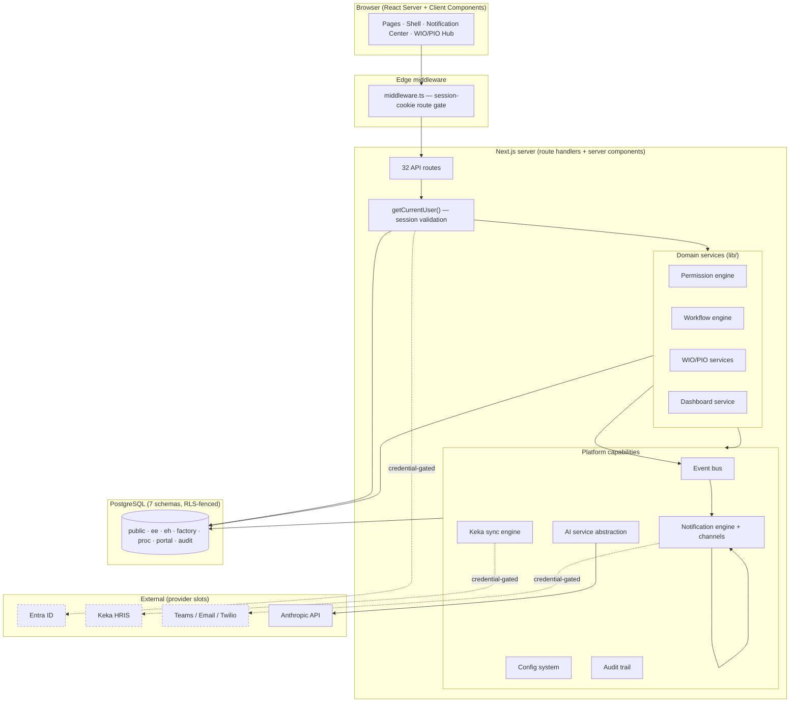

# Essentia Portal — System Architecture

**Baseline as of the platform freeze (2026-07-07).** Foundation + S2 dashboard
+ S4 WIO/PIO Hub + Platform Phases 1 (Auth), 2 (Keka), 3 (Notifications),
all verified. This folder is the authoritative architecture package; per-
subsystem detail lives in the sibling docs referenced below.

| Document | Covers |
|---|---|
| [database.md](database.md) | ERD, schema summary, constraints, indexes, RLS |
| [api-catalogue.md](api-catalogue.md) | All 32 endpoints, auth, formats, errors, versioning |
| [rbac.md](rbac.md) | Role hierarchy, permission/resource/approval matrices |
| [workflows.md](workflows.md) | WIO/PIO lifecycles, approval/escalation/notification flows |
| [events-notifications.md](events-notifications.md) | Event bus + notification framework |
| [PRODUCTION_READINESS.md](PRODUCTION_READINESS.md) | Category scores + production checklist |
| [TECH_DEBT.md](TECH_DEBT.md) | Prioritized technical-debt register |
| [ROADMAP.md](ROADMAP.md) | Recommended sequence forward |
| [../auth.md](../auth.md) · [../keka.md](../keka.md) · [../notifications.md](../notifications.md) · [../wio-pio.md](../wio-pio.md) · [../foundation.md](../foundation.md) | Subsystem deep-dives |

## Inventory (measured, not estimated)

| Metric | Value |
|---|---|
| SQL migrations | 10 (2,067 lines) |
| Database tables | 62 physical across 7 schemas (audit is 1 logical table + 13 monthly partitions) |
| Indexes · Foreign keys · Views · RLS tables | 144 · 111 · 3 (all `security_invoker`) · 4 |
| API routes | 32 |
| Service / lib modules | 54 TypeScript files |
| UI components · pages | 18 · 17 |
| Frontend LOC | ~7,400 TS/TSX |
| Tests | 36 harness checks · 19 unit · 72 E2E assertions (all green) |
| Code smells | 0 TODO/FIXME · 0 `any` · 0 stray `console.log` · 0 `@ts-ignore` · 0 `eslint-disable` |
| Runtime dependencies | 6 (next, react, react-dom, pg, zod, @anthropic-ai/sdk) |

## Tech stack

- **Frontend + backend**: Next.js 14 (App Router), TypeScript (strict), Tailwind (Cold Coffee design tokens), React 18 server components.
- **Database**: PostgreSQL 15 + pgvector. Local dev runs on PGlite over the Postgres wire protocol (`db/dev-db.mjs`) — same client, zero install.
- **Data access**: `pg` pool; RLS fencing enforced by Postgres via per-transaction GUCs + a dedicated non-privileged role.
- **Auth**: session cookies + provider abstraction (Entra OIDC production slot, local password for dev).
- **AI**: provider-agnostic interface (Anthropic active; Azure OpenAI / Copilot slots).
- **Integrations**: Keka (org sync), notification channels (Teams/Email/WhatsApp/SMS/Push) — all behind provider interfaces.

## Layered architecture

## Request lifecycle (representative)

1. **Edge gate** — `middleware.ts` checks the session cookie's presence (Edge-safe, no DB). Unauthenticated page → redirect `/login`; API → 401. Permissive in dev (`AUTH_ALLOW_DEV_LOGIN`).
2. **Session resolution** — the route/page calls `getCurrentUser()`, which validates the session server-side (expiry, idle, revocation) and loads the user's access level + department from `public.users`. The client can never claim a level.
3. **Authorization** — the service calls `requirePermission(user, action, resource)` against the configurable RBAC engine (deny-by-default). A separate layer, Postgres RLS, additionally scopes **row visibility** via `withUserContext`.
4. **Business logic** — the domain service enforces module rules (e.g. the §30 checklist gate, §29 Triangle) and writes through the app role.
5. **Events** — state changes call `publishEvent()`. The notification engine fans out to channels honouring preferences; delivery retries/backoff/dead-letters independently.
6. **Audit** — permission decisions, mutations, workflow actions, AI calls, and notification deliveries write to the immutable, partitioned `audit.log`.

## Cross-cutting design principles

- **Structure is data.** Departments, factory stations, permissions, approval chains, notification routes, business thresholds, and provider selection are all rows — changing them is configuration, not code. Verified: 0 hardcoded department names outside the master; grep-clean of direct notification sends.
- **Provider abstractions everywhere external.** Auth, AI, Keka, and every notification channel depend on an interface; the live implementation is dev-real and the production integration is a fail-loud, credential-gated slot. A misconfiguration errors loudly — it never silently routes to the wrong place.
- **Two enforcement layers, always on.** The RBAC engine governs *actions*; Postgres RLS governs *row visibility*. Neither substitutes for the other.
- **Fail-loud over fail-silent** for configuration/integration errors; **fail-safe** (best-effort, logged) for non-critical side effects (notifications never break the business action that emitted their event).
- **Everything is audited**, on an insert-only, partitioned trail with UPDATE/DELETE revoked from the app role.
