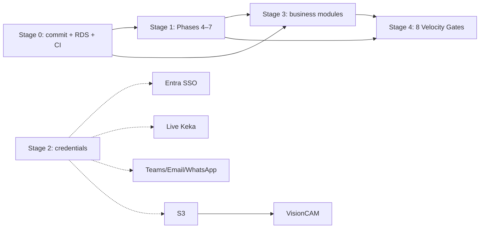

# Recommended Roadmap

From the frozen baseline (Foundation + S2 + S4 + Platform Phases 1–3, all
verified). Sequenced so each step de-risks the next; the guiding principle is
**stand up the operational baseline before adding surface area**, then finish
platform capabilities, then business modules.

## Stage 0 — Baseline hygiene (do first; unblocks everything)

Small, high-leverage, mostly no external dependency:

1. **Commit the platform** (TD-01) — version the working tree, add `.gitignore`, push to remote. *(Blocks nothing technically, but every day unversioned is risk.)*
2. **Provision PostgreSQL** (TD-02) — RDS + pgvector; run `001`–`010`; wire `DATABASE_URL`. Turns the prototype into a persistent system and unlocks backups/DR.
3. **CI/CD** (TD-05) — typecheck + lint + harness + vitest + build on PR; deploy staging on merge.
4. **Next.js security** (TD-03) — assess exposure, patch/plan the major upgrade.

## Stage 1 — Finish the platform (your stated Phase 4–7)

The remaining platform capabilities, in the order you set. Several already
have partial substrate from Phases 1–3:

5. **Phase 4 — Workflow Engine generalization**: conditions, SLAs, timeouts, auto-reminders, delegation, parallel/sequential approval. The engine (definitions/steps/instances/actions, CAS, exact-approver) already generalizes the PIO chain; extend it so WOs, BOQ, letters, and CRM all reuse it. *(No external dep.)*
6. **Phase 5 — API hardening**: versioning (TD-10), distributed rate limiting (TD-07, Redis), CSRF/XSS/payload limits, structured logging (TD-06 start), health endpoints. *(Redis for full rate limiting.)*
7. **Phase 6 — AI service completion**: the abstraction + Anthropic provider are live; add streaming, the modular prompt library, and (credential-gated) Azure OpenAI / Copilot providers. *(Anthropic key.)*
8. **Phase 7 — Observability** (TD-06): metrics, tracing, dashboards, alerting, error reporting, the `api_health` pinger, audit/ops dashboards.

## Stage 2 — Integration activation (as credentials arrive; parallelizable)

Each is a config flip + one provider implementation into an existing slot:

- **Entra ID** (TD-04) → real staff SSO.
- **Keka** (A-19) → live org sync (replaces the fixture; re-arms approvers from live data).
- **Teams / SMTP / Twilio** (A-21/22) → live notification channels.
- **AWS S3** → VisionCAM photo storage (prereq for S3 module below).

## Stage 3 — Business modules (on the finished platform)

Every module plugs into the foundation without structural rework — RBAC gate,
RLS scope, config thresholds, `publishEvent()`, and (where approvals apply)
the generalized workflow engine:

9. **VisionCAM (S3)** — Velocity Gate 1, the billing trigger; photo-gated stage completion. Web side first, then the React Native offline-first app. *(Needs S3.)*
10. **BOQ Engine** — the Triangle's BOQ leg; feeds WIO/PIO gates.
11. **Procurement (S9)** — VRN/WO/PO/GRN, the 20% coordination charge (already modelled as a generated column), three-quotes rule.
12. **Factory (S10)** — NH8 station HODs, PIO assignments, capacity forecast; activate stations 8–9 if confirmed (A-03).
13. **CRM Intelligence** — Communication Spine (S17, AI letters + scroll-to-send gate), Family Profile, Knowledge Library (pgvector).
14. **Finance / Executive dashboards** — AR ladder (events already routed), Founder Morning Brief (S18, the 7 numbers), EH discount gate.

## Stage 4 — Go-live gates (Brief §35)

Validate all **8 Velocity Gates** and the production checklist
([PRODUCTION_READINESS.md](PRODUCTION_READINESS.md)) before launch: VisionCAM
billing, Weekly Pulse auto-draft, WIO clock, VRN revocation, EH discount gate,
Founder Morning Brief, succession pack, Communication Spine.

## Dependency map (what gates what)

## Guidance

- **Business modules can start before every platform phase is done** — the
  foundation already supports them. But Stage 0 should not be skipped: an
  unversioned, un-provisioned system is the biggest risk on the board.
- **Credential-gated work is parallelizable** and mostly S/M effort — each is
  one provider implementation into an interface that already exists and is
  tested against a fixture.
