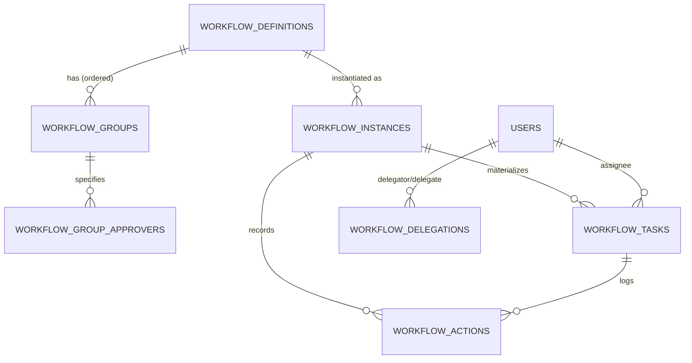
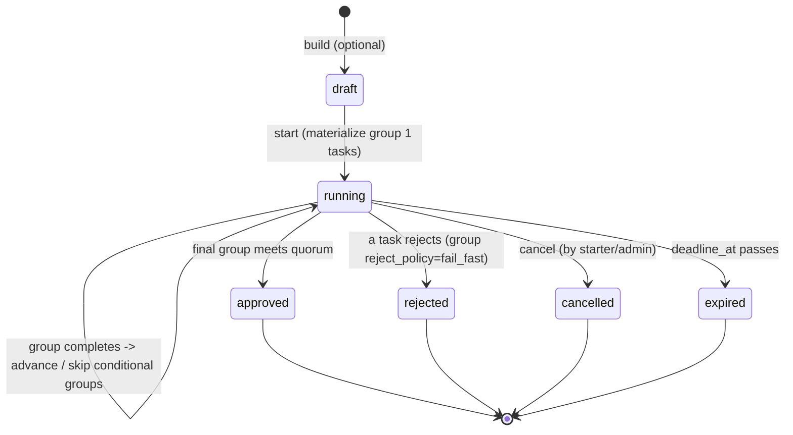

# Workflow Engine Specification (WES v1.0)

> **The engineering contract for the Workflow Engine.** Implementation MUST conform to
> this document. Documentation only — no code, schema, or migrations exist yet. Ratified
> against baseline `platform-baseline-v1` (scheduler + dead-letter policy), PAS v1.0,
> MDG v1.0. Branch: `feature/workflow-engine-v1`.
>
> **Language:** RFC-2119 — **MUST**/**MUST NOT** are binding; **SHOULD** is a strong
> default; **MAY** is optional.
>
> **Refinement note:** this spec supersedes the data-model sketch in
> [PHASE4_WORKFLOW_ENGINE_PLAN.md](PHASE4_WORKFLOW_ENGINE_PLAN.md) §4. The plan proposed
> extending `workflow_steps` with a `step_group`; this contract normalizes that into
> explicit **`workflow_groups`** + **`workflow_group_approvers`** tables (§3). The plan's
> objectives, risks, and rollout remain in force.

**Contents:** [1 Purpose](#1-purpose) · [2 Concepts](#2-core-concepts) ·
[3 ERD](#3-entity-relationship) · [4 Lifecycle](#4-workflow-lifecycle) ·
[5 Parallel](#5-parallel-approval-model) · [6 Sequential](#6-sequential-approval-model) ·
[7 Conditional](#7-conditional-routing) · [8 SLA](#8-sla-engine) ·
[9 Delegation](#9-delegation) · [10 Scheduler](#10-scheduler-integration) ·
[11 Events](#11-event-integration) · [12 Notifications](#12-notification-integration) ·
[13 AI](#13-ai-integration) · [14 Security](#14-security-model) ·
[15 Performance](#15-performance-targets) · [16 Failure](#16-failure-scenarios) ·
[17 Migration](#17-migration-strategy) · [18 Testing](#18-testing-strategy) ·
[19 Extensions](#19-future-extension-points) · [20 ADRs](#20-architecture-decision-records)

---

## 1. Purpose

The Workflow Engine is the platform's single mechanism for **multi-party approval of any
document**. Every module that needs a sign-off (PIO today; WO, BOQ, letters, procurement,
CRM, EH discounts tomorrow) MUST route it through this engine rather than implementing
bespoke approval logic (MDG §7, ADR-004).

**How it differs from the current implementation.** Today's engine
(`workflow_instances` + `workflow_steps` + `actOnWorkflow`) is **sequential and
single-approver**: a document walks steps 1→N, one named person per step, advancing by
compare-and-swap on `current_step`. It MUST be generalized to support:

| Current | WES v1.0 |
|---|---|
| Sequential only | Sequential **and** parallel groups |
| One approver per step | **N-of-M quorum** per group |
| Always runs every step | **Conditional** groups (skip on predicate) |
| No time awareness | **SLA**, **reminders**, **timeouts**, **escalation** |
| Fixed approver | **Delegation** (ad-hoc + standing) |
| `step` is the unit | **`task`** is the unit (assignment, SLA, delegation) |

The generalization MUST be **behaviour-preserving** for the existing PIO chain (ADR-WE-010).

## 2. Core Concepts

| Term | Definition |
|---|---|
| **Workflow Definition** | The versioned template for an approval process, bound to a `resource_type` (e.g. `pio`). Composed of ordered **groups**. |
| **Workflow Group** | An ordered unit within a definition. Holds the **quorum**, optional **condition**, SLA/timeout config, and one or more **approver specifications**. Groups execute in sequence; approvers within a group execute in parallel. |
| **Workflow Instance** | A running (or completed) execution of a definition against one concrete resource (e.g. PIO `ED/26-27/042`). Carries the evaluation **context**. |
| **Workflow Task** | The runtime unit of work: one approver's pending decision within an active group of an instance. SLAs, reminders, delegation, and timeouts attach to the **task**. |
| **Workflow State** | The lifecycle status of an instance or a task (§4). |
| **Workflow Action** | An immutable, audited record of a decision or system event on a task/instance (approve, reject, delegate, escalate, timeout, auto-decision, skip). |
| **Approver** | The identity expected to act on a task — resolved from a group's approver specification (a named user, an access level, or via Keka), optionally re-resolved through an active **delegation**. |
| **Delegation** | A recorded transfer of a task's effective approver to another identity, ad-hoc (one task) or standing (a date window). |
| **SLA** | A per-task time budget (`sla_hours`) after which the task is **breached** and MAY escalate; a `warn_hours` threshold fires an earlier warning. |
| **Timeout** | A per-task hard limit (`timeout_hours`) after which a declared `timeout_action` (auto-approve / auto-reject / escalate) is applied. |
| **Escalation** | Reassigning/alerting a higher authority when a task breaches SLA or times out, per a declared escalation target or ladder. |
| **Parallel Approval** | Multiple tasks in one group acting concurrently; the group completes on **quorum**. |
| **Sequential Approval** | Groups executing one after another; group *k+1* activates only when group *k* completes. |
| **Quorum** | The number of `approved` tasks required to complete a group (`quorum ≤` number of approvers; default 1). |
| **Conditional Step** | A group whose **condition** predicate, evaluated against the instance context, decides whether it runs or is **skipped**. |

## 3. Entity Relationship



**`workflow_definitions`** — the template.
`code PK, name, resource_type FK→resource_types, version INT DEFAULT 1, is_active, created_at`.
A `(code)` is one logical workflow; `version` MUST increment on any structural change, and
an instance MUST pin the version it started under.

**`workflow_groups`** — ordered groups within a definition.
`id PK, definition_code FK, group_no INT, name, quorum INT DEFAULT 1,
reject_policy CHECK(fail_fast|continue) DEFAULT fail_fast, condition JSONB NULL,
sla_hours INT NULL, warn_hours INT NULL, timeout_hours INT NULL,
timeout_action CHECK(auto_approve|auto_reject|escalate) NULL, reminder_hours INT NULL,
UNIQUE(definition_code, group_no)`. `condition IS NULL` MUST mean "always run".

**`workflow_group_approvers`** — the approver specification(s) for a group (≥1; >1 = parallel).
`id PK, group_id FK, approver_type CHECK(user|access_level|role|dynamic),
approver_user_id FK→users NULL, approver_level access_level NULL, approver_ref VARCHAR NULL,
approver_hint VARCHAR, escalation_type/escalation_ref NULL`. Exactly one of the approver
targets MUST be populated per row consistent with `approver_type`.

**`workflow_instances`** — a running execution.
`id PK, definition_code FK, definition_version INT, resource_type, resource_id UUID,
status CHECK(draft|running|approved|rejected|cancelled|expired) DEFAULT running,
current_group INT DEFAULT 1, context JSONB DEFAULT '{}', started_by FK→users,
started_at, deadline_at TIMESTAMPTZ NULL, completed_at, terminal_reason TEXT`. A partial
unique index MUST enforce **one non-terminal instance per (definition_code, resource_id)**.

**`workflow_tasks`** — runtime per-approver unit (the new heart of the engine).
`id PK, instance_id FK, group_no INT, assignee_user_id FK→users,
delegated_to_user_id FK→users NULL,
status CHECK(pending|approved|rejected|skipped|delegated|timed_out|escalated|expired) DEFAULT pending,
assigned_at, sla_due_at NULL, warn_at NULL, timeout_at NULL, reminded_at NULL,
acted_by FK→users NULL, acted_at NULL, comments TEXT,
UNIQUE(instance_id, group_no, assignee_user_id)`. Indexes: `(assignee_user_id, status)`
(inbox), partial `(sla_due_at) WHERE status='pending'`, partial `(timeout_at) WHERE status='pending'`.

**`workflow_actions`** — immutable audit-adjacent log.
`id PK, instance_id FK, task_id FK NULL, group_no INT NULL,
action CHECK(approve|reject|delegate|escalate|timeout|auto_approve|auto_reject|remind|skip|cancel),
acted_by FK→users NULL, delegate_id FK→users NULL, comments, acted_at`. Insert-only.

**`workflow_delegations`** — standing/out-of-office delegation (supporting table).
`id PK, delegator_id FK, delegate_id FK, from_date, to_date,
definition_code VARCHAR NULL (NULL=all workflows), created_by, created_at, revoked_at NULL`.

**Disposition of `workflow_steps`:** migration `013` introduces the group model and
re-expresses the seeded PIO chain as groups; the legacy `workflow_steps` table becomes
unused and MUST be retired in `013` (or a documented follow-up) once no data references it
(§17). No shipped migration is edited (ADR-010).

## 4. Workflow Lifecycle

**Instance states:** `draft → running → { approved | rejected | cancelled | expired }`.
`approved` is the successful terminal ("completed").

**Task states:** `pending → { approved | rejected | skipped | delegated | timed_out | escalated | expired }`.



**Transition rules (MUST):**
- An instance starts in `running` (or `draft` if a module stages it) and materializes the
  first **applicable** group's tasks.
- A group **completes** when `count(tasks.status='approved') >= group.quorum`.
- On completion the engine advances `current_group` (CAS) and materializes the next
  applicable group, **skipping** groups whose condition is false (their tasks are recorded
  `skipped`). When no further group exists, the instance becomes `approved`.
- A task `rejected` in a `fail_fast` group MUST transition the instance to `rejected`
  immediately; open sibling tasks become `skipped`. A `continue` group records the
  rejection but still completes if quorum is otherwise met.
- `cancelled` MAY be applied to any non-terminal instance by the starter or an admin.
- `expired` applies when `deadline_at` passes with the instance non-terminal.
- **Escalated** and **timed_out** are **task** outcomes (§8), not instance terminals; they
  drive reassignment/notification but the instance remains `running` unless the timeout
  action resolves the group.
- Terminal instance/task states MUST be immutable.

## 5. Parallel Approval Model

A group with M `workflow_group_approvers` materializes M `workflow_tasks` at activation.
- **Quorum:** the group completes when `quorum` tasks are `approved`. `quorum=1` = "first
  approval wins"; `quorum=M` = "all must approve".
- **First approval:** on reaching quorum, the engine MUST mark remaining `pending` sibling
  tasks `skipped` and advance.
- **All approvals:** with `quorum=M`, every task MUST approve; any rejection applies the
  reject policy.
- **Rejection behaviour:** `fail_fast` (default) → first rejection fails the instance;
  `continue` → rejection recorded, group still completes if quorum met by others.
- **Timeout behaviour:** each task carries its own SLA/timeout; a timed-out task applies
  its `timeout_action` **without** blocking sibling tasks.
- **Concurrency (MUST):** each approval is a **compare-and-swap** on the task
  (`UPDATE … WHERE id=$task AND status='pending'`); a losing concurrent write matches zero
  rows and returns 409. Group completion is a single atomic count check after each CAS —
  no `FOR UPDATE`, no double-advance (ADR-WE-003).
- **Audit:** every task creation, decision, skip, and the group-completion advance MUST be
  recorded in `workflow_actions` and the audit trail.

## 6. Sequential Approval Model

- **Group execution:** exactly one group is "current" per instance; only its tasks are
  `pending`.
- **Completion:** as §5 — quorum of approvals.
- **Advance rules (MUST):** advancing is `UPDATE workflow_instances SET current_group=$next
  WHERE id=$id AND status='running' AND current_group=$k` (CAS). The next **applicable**
  group (first whose condition passes) is materialized; skipped groups are recorded.
- **Rollback policy:** the engine is **forward-only** — an approved group is **not**
  re-opened. A change of decision MUST be handled by cancelling the instance and starting a
  new one (a fresh version if the definition changed), never by rewinding
  `current_group`. This keeps the approval history append-only and auditable (ADR-WE-010).

## 7. Conditional Routing

A group's `condition` is a **restricted JSON predicate** evaluated against
`instance.context` (a declared, whitelisted key set per definition). It MUST be evaluated
by a pure engine function; it MUST NOT be executed as code.

**Predicate grammar (MUST):**
```
Predicate := { "op": Logical, "clauses": [Predicate, ...] }
           | { "field": <whitelisted key>, "op": Comparison, "value": Literal }
Logical    := "and" | "or" | "not"
Comparison := "==" | "!=" | "<" | "<=" | ">" | ">=" | "in" | "not_in" | "exists"
Literal    := string | number | boolean | array-of-those
```

**Allowed:** the operators above; comparison against context fields; nesting via
and/or/not. **Forbidden (MUST NOT):** arbitrary code / `eval` / `Function`; template or
string interpolation; SQL; shell; network; unbounded regular expressions; arithmetic
expressions; references to anything outside `instance.context` (no env, no DB reads, no
field-to-field except within context values).

**Validation & safety (MUST):**
- A condition MUST be validated when the definition is saved: unknown operator → reject the
  definition; field not in the declared context schema → reject.
- At runtime an absent context field MUST be treated as `null`/absent (so `exists` and
  comparisons are well-defined); evaluation MUST be total (never throw) and MUST NOT have
  side effects.
- Evaluation MUST be deterministic and bounded (max nesting depth, e.g. 8; max clauses,
  e.g. 32) to prevent pathological predicates.

## 8. SLA Engine

- **Timers:** at task activation the engine sets `sla_due_at = assigned_at + sla_hours`,
  `warn_at = assigned_at + warn_hours`, `timeout_at = assigned_at + timeout_hours` (each
  only if configured). v1 uses **calendar hours**; business-hours SLAs MAY be added later
  behind config.
- **Warning threshold:** when `warn_at` passes and the task is still `pending`, the sweep
  MUST publish `workflow.sla_warning` once (deduped) — an early nudge before breach.
- **Deadline (breach):** when `sla_due_at` passes and the task is still `pending`, the
  sweep MUST publish `workflow.sla_breached` and trigger the group's escalation target (if
  any). Breach does not itself decide the task.
- **Reminders:** if `reminder_hours` is set, the sweep MUST re-notify the assignee on that
  cadence while `pending` (`workflow.task_reminded`), deduped per interval.
- **Escalation:** on breach or `timeout_action='escalate'`, the engine reassigns/alerts the
  declared escalation target (a named user / access level / ladder). The original task is
  marked `escalated`; a new task MAY be materialized for the escalation target.
- **Scheduler interaction:** all of the above are computed from **timestamps**, so
  correctness is independent of tick timing. A registered scheduler job **`workflow-timers`**
  (§10) performs the sweep on cadence; a missed tick only delays detection, never corrupts
  state (ADR-WE-007).

## 9. Delegation

- **Temporary (ad-hoc):** `delegateTask(taskId, toUser)` sets `delegated_to_user_id`; the
  delegate becomes the task's **effective approver**. Recorded as a `delegate` action.
- **Permanent / standing (out-of-office):** a `workflow_delegations` row (delegator →
  delegate, date window, optional definition scope). At task materialization the engine
  MUST resolve the assignee through any **active** delegation (window covers now, not
  revoked). Chained delegations MUST resolve to a single terminal delegate (no cycles;
  bounded resolution).
- **Effective approver (MUST):** only the resolved effective approver (delegate, else
  assignee) MAY act; the identity check accepts exactly that user (or an admin override,
  §14). The original assignee MUST be retained on the task for the audit trail.
- **Audit (MUST):** delegation events and any delegated decision MUST record **both**
  identities (delegator and delegate) in `workflow_actions` and the audit trail.

## 10. Scheduler Integration

- **The job:** one registered job **`workflow-timers`** in `portal.scheduled_jobs`
  (`interval`, default 15 min), handler `evaluateWorkflowTimers()`, running as the **L1
  auto-pilot system account**. It processes due warnings, breaches, reminders, and
  timeouts. No new scheduler mechanism — it reuses the framework shipped in `011`/`012`.
- **Retry policy:** inherits the scheduler's `max_attempts` + exponential backoff. The
  handler MUST be **idempotent** (guards on task state + event `dedupe_key`), so a retried
  sweep never double-escalates or double-decides.
- **Failure policy:** a failing sweep dead-letters after retries and alerts platform admins
  via the `012` policy (`scheduler.job_dead` → `platform_admins`). A failure MUST NOT wedge
  the schedule (other jobs proceed) nor corrupt workflow state.
- **Locking strategy:** single-fire is enforced by the scheduler's `UNIQUE(job_id,
  scheduled_for)` claim — exactly one instance runs a given sweep slot, even under
  horizontal scale. Within the sweep, each task action is an independent CAS.

## 11. Event Integration

The engine is a first-class publisher (ADR-004); it MUST publish (never send notifications
directly). Every event is immutable, attributable, and deduped (PAS §5).

| Event | When | Category | Key payload | dedupeKey |
|---|---|---|---|---|
| `workflow.started` | instance starts | workflow | instanceId, definition, resourceRef | instanceId |
| `workflow.group_activated` | a group's tasks materialize | workflow | instanceId, groupNo | instanceId:groupNo |
| `workflow.task_created` | a task is assigned | approval | taskId, assignee, resourceRef | taskId |
| `workflow.task_reminded` | reminder cadence | approval | taskId | taskId:remindWindow |
| `workflow.sla_warning` | warn_at passes | approval | taskId | taskId:warn |
| `workflow.sla_breached` | sla_due_at passes | approval | taskId | taskId:breach |
| `workflow.task_delegated` | delegation | approval | taskId, delegator, delegate | taskId:delegatedAt |
| `workflow.task_completed` | approve/reject on a task | approval | taskId, decision, actor | taskId:decision |
| `workflow.escalated` | escalation fires | approval | taskId, escalationTarget | taskId:escalate |
| `workflow.timed_out` | timeout applied | approval | taskId, action | taskId:timeout |
| `workflow.approved` | instance approved | approval | instanceId, resourceRef | instanceId:approved |
| `workflow.rejected` | instance rejected | approval | instanceId | instanceId:rejected |
| `workflow.cancelled` | instance cancelled | workflow | instanceId | instanceId:cancelled |
| `workflow.expired` | deadline passes | workflow | instanceId | instanceId:expired |

Existing `workflow.step_pending`/`approved`/`rejected` routes MUST remain valid during the
PIO transition (mapped to the new task events).

## 12. Notification Integration

Delivery is entirely via the notification framework (data-driven `event_routes`); the
engine names no channel (ADR-004).

| Trigger event | Recipients (strategy) | Template | Channels | Priority |
|---|---|---|---|---|
| `workflow.task_created` | task assignee (`workflow_task_assignee`) | `approval_request` | in_app, teams | action_required |
| `workflow.task_reminded` | assignee | `approval_reminder` | in_app | action_required |
| `workflow.sla_warning` | assignee | `sla_warning` | in_app | action_required |
| `workflow.sla_breached` | assignee + escalation target | `sla_breached` | in_app, email | urgent |
| `workflow.escalated` | escalation target + starter | `escalation` | in_app, email | urgent |
| `workflow.task_completed` | starter | `approval_granted`/`_rejected` | in_app | informational |
| `workflow.approved`/`rejected` | starter | existing | in_app | informational |

- **Recipients:** resolved by strategy (a new `workflow_task_assignee` extends today's
  `workflow_step_approver`). Ops-level failures use `platform_admins` (`012`).
- **Templates:** per-channel renderings; new templates MUST be unit-tested even when a
  channel is credential-gated.
- **Preferences & quiet hours:** honoured by the engine — interruptive channels deferred in
  quiet hours; **urgent (breach/escalation) MAY bypass** quiet hours; in-app is the floor.
- **Retry / dead-letter:** inherited from the framework (exponential backoff → dead-letter,
  audited). Notification failure MUST NOT affect workflow state (decoupled).

## 13. AI Integration

AI participation is **advisory-only**, behind the `lib/ai` abstraction, and every touch is
audited with model + prompt version + inputs + output (explainability).

**AI MAY:** summarize the document under review for the approver; recommend/route hints;
highlight anomalies (unusual amounts/terms); **estimate SLA-breach risk** for prioritization.

**AI MUST NOT:** approve; reject; delegate; modify any workflow state; set/alter SLAs;
resolve a quorum; or take any irreversible or outward-facing action. Every AI output is an
input to a **human decision** (ADR-013 / ADR-WE-009). An AI failure MUST NOT block a
workflow — approvals proceed without the advisory content.

## 14. Security Model

- **Permission checks (MUST):** all operations gate on the `workflows` resource via
  `requirePermission` in the service — `read` (view instance/inbox), `approve`, `reject`,
  `delegate`, and `manage` (definitions). Deny-by-default; policy is data (ADR-002).
- **RLS (MUST):** task visibility is fenced under `essentia_app` — an assignee (or their
  delegate) sees their own tasks; L0/L1 see broadly; instance visibility additionally
  inherits the underlying resource's RLS. Verified under the non-owner role (ADR-003).
- **Audit (MUST):** every action (assign, approve, reject, delegate, escalate, timeout,
  auto-decision, skip, cancel) writes through the single `writeAudit` choke point;
  insert-only, attributable.
- **Impersonation (MUST NOT):** no human MAY act as another. The **system account** MAY
  perform only **opt-in** auto/timeout actions and is clearly attributed as the actor
  (`acted_by = auto-pilot`), never masquerading as a human approver.
- **Delegation security (MUST):** only the assignee or an admin MAY create an ad-hoc
  delegation for a task; standing delegations are created by the delegator or an admin. The
  delegate MUST be an active user; expired/revoked delegations MUST NOT resolve. Both
  identities are audited. Auto-decisions MUST be disallowed on resources flagged sensitive
  (e.g. financial) unless a definition explicitly opts in.

## 15. Performance Targets

Bounds keep the engine predictable and the topology non-pathological (ADR-WE-002):

| Dimension | Target / limit |
|---|---|
| Groups per definition | ≤ 20 |
| Approvers per group (parallel breadth) | ≤ 25 |
| Approval depth (sequential groups) | ≤ 20 |
| Open tasks per instance (concurrent) | ≤ 50 |
| Condition nesting depth / clauses | ≤ 8 / ≤ 32 |
| Task act (approve/reject) p95 | < 100 ms (excl. network), single CAS + count |
| Inbox query p95 | < 150 ms (indexed by assignee) |
| SLA sweep | process ≥ 1,000 due tasks per tick within the 15-min cadence |

**Database expectations:** parameterized queries only; single-statement CAS for all state
changes; no `FOR UPDATE`. **Index strategy (MUST):** `workflow_tasks(assignee_user_id,
status)` (inbox); partial `workflow_tasks(sla_due_at) WHERE status='pending'` and
`(timeout_at) WHERE status='pending'` (sweep); `workflow_instances(definition_code,
resource_id) WHERE status not terminal` (one-live guard); `workflow_actions(instance_id,
acted_at)` (timeline).

## 16. Failure Scenarios

| Scenario | Required behaviour |
|---|---|
| **Database outage** | All state changes are single transactions; a failed write rolls back wholly. No partial group advance, no orphan task. The API returns 5xx; the client retries. |
| **Scheduler outage** | Timers pause; on resume the catch-up grace processes overdue warnings/breaches/timeouts (computed from timestamps). **No SLA data loss** — only delayed detection. |
| **Notification outage** | Deliveries queue/retry/dead-letter independently; **workflow state is unaffected** (decoupled via events). Approvals continue. |
| **Duplicate events** | Idempotent via `dedupe_key` (PAS §5); a re-published event performs no side effect. |
| **Concurrent approvals** | CAS on the task: exactly one wins; the loser gets 409. Quorum is an atomic count after each CAS — no double-advance (ADR-WE-003). |
| **Rollback behaviour** | The engine is forward-only (§6): approved groups never re-open; corrections are new instances. A failed transaction leaves no visible change. |
| **Recovery behaviour** | All state lives in the DB; a restart resumes exactly where it left off. The next `workflow-timers` sweep reconciles overdue timers. No in-memory workflow state. |

## 17. Migration Strategy

- **PIO migration (MUST):** migration `013` re-expresses the seeded `pio_approval` chain as
  **3 groups of 1 approver, quorum 1, no condition/SLA** — behaviourally identical. The
  existing PIO harness checks MUST pass unchanged (the regression gate).
- **Backward compatibility:** the mapping preserves approver identity (Khushpreet → Deepak
  Ji → Hardesh) and the "one live instance per document" guarantee. Legacy
  `workflow.step_*` event routes remain valid during transition.
- **Zero data loss (MUST):** in dev only the PIO *definition* is seeded (no in-flight
  instances), so migration is a re-seed. For production (post-RDS), the migration MUST
  transactionally materialize `workflow_tasks` for any `pending` instance from its
  `current_step`, verified by row counts before/after; nothing is deleted until the new
  state is confirmed.
- **Rollback strategy:** `013` is forward-only and idempotent (ADR-010); rollback is via a
  compensating down-migration or a restore point (documented in the migration header).
  Retiring `workflow_steps` MUST occur only after the group model is confirmed populated.
- Register `013` in `db/lib.mjs`; the harness MUST load `001`–`013` clean.

## 18. Testing Strategy

| Tier | MUST cover |
|---|---|
| **Unit** | `evaluateCondition` (grammar, forbidden-op rejection, absent-field, bounds); SLA/warn/timeout arithmetic; delegation resolution (windows, chains, cycles) |
| **Integration (harness)** | group activation/skip (conditional); quorum completion; reject `fail_fast` vs `continue`; advance CAS; task/instance state invariants |
| **Workflow** | full multi-group parallel + conditional instance end-to-end; delegation path; escalation path |
| **Scheduler** | `workflow-timers` sweep: warning, breach, reminder, timeout actions; idempotency under retry; single-fire |
| **Permissions** | deny-by-default per action; RLS task visibility per level; delegation authorization |
| **Concurrency** | simultaneous approvals (one wins, no double-advance); concurrent sweep + human action |
| **Regression** | the existing PIO chain checks green, unchanged; full harness (currently 44) + unit (currently 25) stay green |
| **Performance** | inbox + act within §15 targets on a seeded dataset; sweep throughput |

Green bar (harness, unit, typecheck, lint, build) + an HTTP E2E MUST pass before merge.

## 19. Future Extension Points

Each module attaches by declaring a **definition** (data) and calling `startWorkflow` — no
engine changes:

| Module | Workflow use |
|---|---|
| **Procurement** | WO / PO approval (value-conditional groups; ≥ threshold adds COO/CEO); three-quotes gate as a group condition |
| **BOQ** | BOQ sign-off feeding the Triangle; parallel design + commercial review |
| **Factory** | PIO already; station-level release approvals |
| **CRM** | Communication Spine letters (approve-before-send; scroll-to-send is a UI gate atop a task) |
| **EH** | Discount approval (conditional on discount %; routes to Amit / L1) |
| **VisionCAM** | Billing-milestone sign-off gated on the required photo |
| **Vendor / Client Portal** | External-initiated requests entering an internal approval instance |
| **Executive Dashboard** | Approval-load & SLA-health widgets sourced from workflow events |
| **AI** | Advisory summaries / risk / SLA-breach estimates on any task (§13) |

## 20. Architecture Decision Records

Permanent decisions introduced by the Workflow Engine. None may change without an
architecture review + a superseding ADR.

| ADR | Decision |
|---|---|
| **WE-ADR-001** | **Relational DSL** — definitions are `groups` + `group_approvers` rows, not a JSON blob or BPMN document. Queryable, diffable, "structure is data" (ADR-001). |
| **WE-ADR-002** | **Bounded topology** — a workflow is a *sequence of groups*, each a *parallel quorum* with an *optional condition*. No loops, no sub-workflows, no arbitrary DAGs. |
| **WE-ADR-003** | **CAS concurrency** — every state change is a single-statement compare-and-swap; quorum is an atomic count; **no `FOR UPDATE`**. |
| **WE-ADR-004** | **The task is the unit** of assignment, SLA, reminder, delegation, and timeout — not the step. |
| **WE-ADR-005** | **Restricted condition DSL** — a whitelisted, non-`eval`, side-effect-free JSON predicate over declared context, validated at definition-save time. |
| **WE-ADR-006** | **Exact-approver identity** — only the resolved effective approver (assignee or active delegate) may act; the system account performs only opt-in auto/timeout actions and never impersonates a human. |
| **WE-ADR-007** | **Timer correctness from timestamps** — SLAs/timeouts are computed from stored times and swept by the scheduler; correctness is independent of tick timing. |
| **WE-ADR-008** | **Forward-only history** — approved groups never re-open; a change of mind is a new instance. The action log is append-only. |
| **WE-ADR-009** | **AI is advisory-only** — it may summarize/recommend/flag/estimate; it may never approve, reject, or mutate workflow state (inherits ADR-013). |
| **WE-ADR-010** | **Backward compatibility** — the PIO chain MUST behave identically after migration; the PIO regression tests gate the merge. |

---

*This specification is the contract for Workflow Engine implementation. No code, schema,
or migration exists yet. On approval, implementation begins with migration `013` +
the generalized engine, PIO regression first (Rollout step 1). Companion:
[PHASE4_WORKFLOW_ENGINE_PLAN.md](PHASE4_WORKFLOW_ENGINE_PLAN.md),
[PLATFORM_ARCHITECTURE_SPECIFICATION.md](PLATFORM_ARCHITECTURE_SPECIFICATION.md).*
