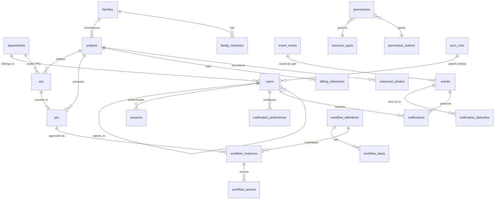

# Database Architecture

PostgreSQL 15 + pgvector. **7 schemas, 62 physical tables** (48 logical +
14 audit partitions), **144 indexes, 111 foreign keys, 3 views** (all
`security_invoker`), **RLS on 4 tables**. The golden thread is
`project_code` (`ED/YY-YY/NNN`), which links every document.

## Schemas

| Schema | Tables | Purpose |
|---|---|---|
| `public` | 7 | Identity + master data: `users`, `departments`, `families`, `family_members`, `permissions`, `permission_actions`, `resource_types` |
| `ee` | 10 | essentia environments: `projects`, `wio`, `pio`, `visioncam_photos`, `billing_milestones`, `activity_phases`, `design_stages`, `site_trades`, `order_confirmations`, `replacement_orders` |
| `eh` | 3 | essentia home: `experience_centres`, `sales`, `daily_checklist` |
| `factory` | 3 | NH8: `departments` (stations), `pio_assignments`, `capacity_forecast` |
| `proc` | 5 | Procurement: `vendors`, `work_orders`, `wo_line_items`, `purchase_orders`, `goods_received_notes` |
| `portal` | 20 | Intelligence + platform: sessions, events, deliveries, preferences, event_routes, workflow_*, sync_runs, notifications, notification_templates, ai_prompts, app_config, api_health_*, communication_spine, knowledge_library, founder_brief, autopilot_log |
| `audit` | 14 | Immutable `log` (monthly `RANGE` partitions through 2027-06) |

## ERD — golden-thread core

## Row-Level Security (the L0–L3 fence)

RLS is enabled on `ee.projects`, `public.families`, `ee.billing_milestones`,
`eh.sales`. Policies read two per-transaction GUCs set by
`withUserContext`: `app.user_id` and `app.user_access_level`.

- **L0/L1** see everything; **L2** see their department's / team projects;
  **L3** see only projects they are assigned to; family visibility follows
  project-team membership (§5).
- **`SET LOCAL ROLE essentia_app`** wraps every fenced transaction — Postgres
  skips RLS for superusers/owners, so enforcement must not depend on the
  connection user (fixed in `db/007`, S4 verification).
- The 3 clock/status **views are `security_invoker`** so fencing holds through
  them (fixed in `db/001`).

## Constraints & data-integrity highlights

- **Generated columns** (`STORED`): WO coordination charge (20%, `CHECK IN
  (0,20)` — cannot be deleted), total value, delay penalty (1%/wk cap 5%),
  line-item amounts.
- **Auto-generated document numbers** via sequence functions + a BEFORE-INSERT
  trigger on `ee.projects` (all 9 formats: project/WIO/PIO/WO×3/PO/VRN/OC/RIO).
- **Duplicate prevention**: partial unique index on `workflow_instances`
  (one pending approval per document); `UNIQUE(event, recipient, channel)` on
  deliveries; partial unique on `events(dedupe_key)`.
- **Immutability**: `audit.log` has UPDATE/DELETE revoked from `essentia_app`;
  `sessions` store only the SHA-256 of the token.
- **Referential**: `ee.wio.department_code` → `public.departments(code)` FK
  makes WIO routing reject any department outside the Master.

## Migration history

| File | Adds |
|---|---|
| `001` | Full schema (7 schemas, 28 core tables, RLS, doc-number generators) — repaired v1.1 (see CHANGELOG) |
| `002` | Department Master (24) + factory stations + ECs, provenance-cited |
| `004` | Foundation: Department Master wiring, Factory Master (7+2), RBAC engine, workflow engine, notification templates, config, audit partitions, AI prompt registry |
| `005` | WIO/PIO module config |
| `006` | S4 hardening: `audit.actor_role`, lifecycle notification templates |
| `007` | `essentia_app` role + grants (RLS enforcement) |
| `008` | Auth: `sessions`, password/MFA columns, auth config |
| `009` | Keka: `sync_runs`, workflow `approver_email`, mapping config |
| `010` | Notification framework: events, deliveries, preferences, routes |

(`003` was superseded by the `004` permission engine; `900_dev_fixtures.sql`
is dev-only and never runs in production.)

## Local dev vs production

Production runs real PostgreSQL 15 + pgvector (AWS RDS). Local dev uses
PGlite over the wire protocol (`npm run dev-db`) — the app connects with the
ordinary `pg` pool, `PGPOOL_MAX=1`. Data is in-memory (restart = fresh
fixtures). Schema is proven to load end-to-end by `npm run validate` (36
checks incl. document formats, the golden-thread trigger, RLS matrix,
timeout predicates, delivery dead-letter).
