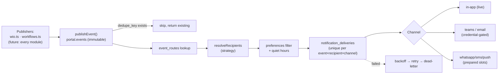
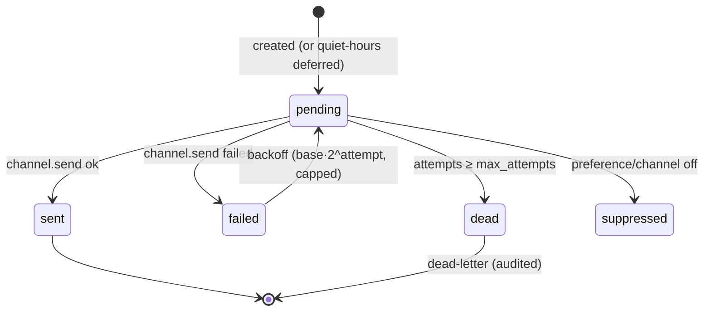

# Event Bus & Notification Framework

`Business action → publishEvent() → portal.events → engine (route + recipients
+ preferences) → per-channel deliveries (retry/backoff/dead-letter) → channels`

No module sends notifications directly — grep-verified. Full subsystem detail:
[../notifications.md](../notifications.md).

## Event bus

### Event catalogue (`portal.event_routes` — data-driven)

| Event type | Category | → Notification type | Recipient strategy | Channels |
|---|---|---|---|---|
| `wio.created` | project | assignment | explicit (TL) | in_app |
| `wio.converted` | project | workflow_completed | explicit | in_app |
| `wio.cancelled` | project | workflow_cancelled | explicit | in_app |
| `wio.clock_alert` | project | deadline | explicit | in_app, email |
| `wio.clock_overdue` | project | delay | explicit | in_app, email |
| `workflow.step_pending` | approval | approval_request | current-step approver | in_app, teams |
| `workflow.approved` | approval | approval_granted | workflow starter | in_app |
| `workflow.rejected` | approval | approval_rejected | workflow starter | in_app |
| `ar.overdue` | project | escalation | explicit | in_app, email |
| `system.alert` | system | system_alert | explicit | in_app |

- **Categories** (8): workflow, approval, user, project, department, system, ai, integration.
- **Recipient strategies**: explicit · actor · project_tl · workflow_step_approver · workflow_started_by.
- **Event fields**: id, event_type, category, entity_type/id/ref, actor_id, department_id, priority, payload, correlation_id, dedupe_key, created_at. (Retry count lives on the *delivery* — the event is immutable.)
- **Publishers today**: `wio.ts` (created/converted/cancelled/clock), `workflows.ts` (step_pending/approved/rejected). **Subscriber**: the single notification engine (`dispatchEvent`) — a fan-in point every future module reuses.

## Delivery engine

- **Retry**: exponential backoff (`notifications.retry_base_seconds` × 2^attempt,
  capped), `max_attempts` then **dead-letter**. Driven by
  `POST /api/jobs/notifications/dispatch`.
- **Duplicate prevention**: `UNIQUE(event_id, recipient_id, channel)`.
- **Deduplication**: partial unique index on `events(dedupe_key)`.
- **Lifecycle tracked**: sent / read / acknowledged / archived / expires.
- **Audit**: every attempt → `NOTIFICATION_DELIVERY`; dead-letters →
  `NOTIFICATION_DEAD_LETTER` (recipient, channel, event, status).

## Channel / provider model

| Channel | Status | Notes |
|---|---|---|
| In-app | **Live** | Writes `portal.notifications`; the Notification Center |
| Teams | Code-complete, credential-gated | Real Adaptive Card built + posted to `teams.webhook_url` |
| Email | Code-complete, credential-gated | Real branded HTML; sends via `SMTP_URL` (A-21) |
| WhatsApp / SMS / Push | Prepared slots | Fail-loud until Twilio / FCM-APNs (A-22) |

`notifications.channels_live` config gates which channels actually attempt.
Adaptive-card and email-HTML builders are unit-tested even without live send.

## Preferences

Per user (`portal.notification_preferences`): channel opt-ins, category mutes
(system always delivers), quiet hours (defer interruptive channels; urgent
bypasses), digest frequency (stored; digest builder pending). In-app is always
allowed unless the category is muted. `GET/PUT /api/notifications/preferences`.

## Notification Center (reusable UI)

Header component ([NotificationCenter.tsx](../../frontend/components/notifications/NotificationCenter.tsx)):
bell + live unread badge (30s poll), all/unread filters, search, per-item
read/archive, mark-all-read, deep links. Consumes the inbox only — module-
agnostic, verified in-browser.

## Keka integration (event-adjacent)

Org sync (fixture provider live; live-Keka slot A-19) upserts users /
hierarchy / designations, maps departments onto the Master, and resolves the
PIO approver chain. Sequence + failure handling: [../keka.md](../keka.md).
