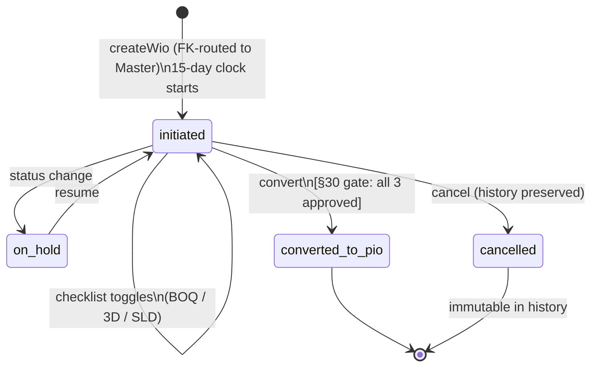
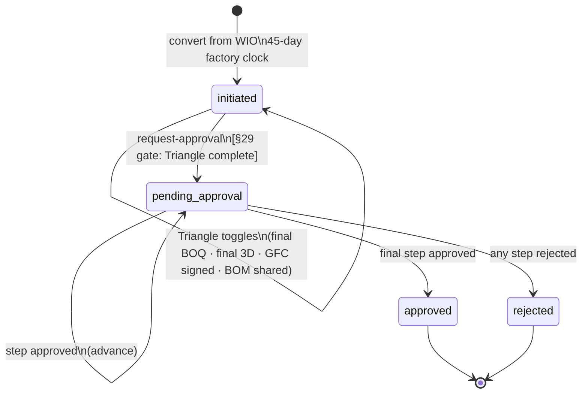
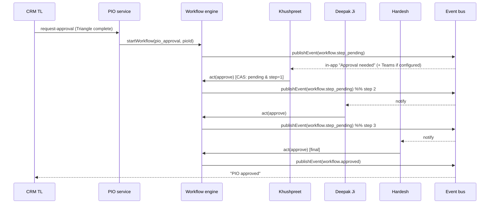
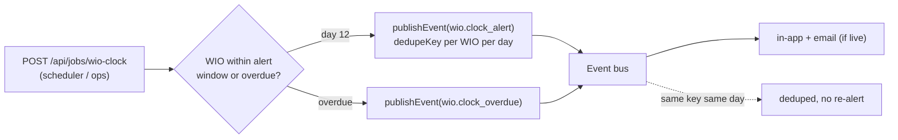

# Workflow, Approval & Escalation Flows

The order spine's first segment: work initiation (WIO) → production
initiation (PIO) → the §26 approval chain. Two permanent gates cannot be
bypassed: the §30 three-item checklist and the §29 Triangle of Agreement.

## WIO lifecycle

- **§30 gate**: `convertWioToPio` refuses with the exact missing items
  ("Approved BOQ + Approved 3D pending…") until all three are checked.
- **Clock RAG** (view `ee.wio_clock`): green >5d, amber ≤5d, red ≤2d,
  overdue past target. Row-locked convert prevents a double-PIO race.
- **Cancellation** never deletes — the row leaves the clock view but stays
  searchable in history with all timestamps, approvals, and audit intact.

## PIO lifecycle

- **§29 gate**: `requestPioApproval` refuses until all four Triangle items
  align (BOQ = 3D = client-signed GFC = shared BOM).

## Approval flow (workflow engine, generic)

- **Concurrency**: the decision is a single compare-and-swap
  (`UPDATE … WHERE status='pending' AND current_step=$n`) — a concurrent
  second decision matches zero rows and is refused (409). No `FOR UPDATE`.
- **Exact-approver**: a step belongs to a named person (resolved from
  `approver_email` at Keka sync). Wrong approver → 403; unresolved → 409
  naming the intended person.

## Escalation flow (§30 clock)

- Escalation targets the project's CRM TL (§30 ownership). Dedup is now
  centralized in the event bus (`dedupe_key`), replacing the old manual guard.
- AR ladder (§36: 45d→TL, 60d→Deepak Ji, 90d→founders) is modelled via
  `ar.overdue` events + config `ar.escalation_days` (routing seeded).

## Notification flow

Every flow above emits **domain events**, never direct sends. The event bus →
notification engine → channels pipeline is documented in
[events-notifications.md](events-notifications.md).
