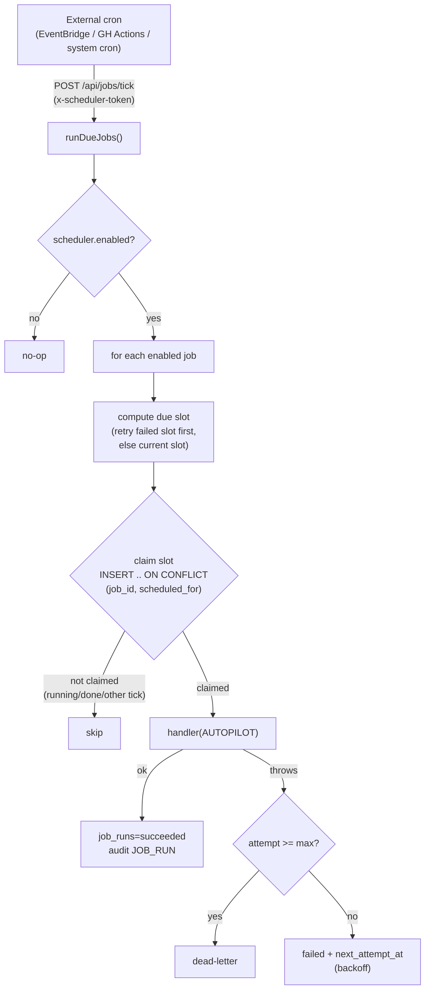

# Scheduler / Job Framework (auto-pilot)

The platform's background-work engine. Resolves the long-standing gap A-14 /
[IG-06](architecture/INFRA_GAP_ANALYSIS.md) — the job routes existed but had no
cadence owner. Built to the ratified contract:
[PAS §6](architecture/PLATFORM_ARCHITECTURE_SPECIFICATION.md#6-scheduler-standards)
and [MDG §9](architecture/MODULE_DEVELOPMENT_GUIDE.md#9-scheduler-requirements).

> **Status:** live (dev, verified end-to-end). Migration `011`. The scheduler holds
> **no business logic** — it triggers registered job handlers and records outcomes.

---

## How it works

**Cadence is data.** `portal.scheduled_jobs` holds each job's schedule; changing a
cadence is a row update, never a deploy.
- `schedule_kind='interval'` → `schedule_expr` = seconds (e.g. `'60'`).
- `schedule_kind='daily'` → `schedule_expr` = `'HH:MM'` (server time).

**Single-fire locking.** The lock is the DB, not a mutex: `UNIQUE(job_id,
scheduled_for)` on `portal.job_runs`. Two concurrent ticks (or two app instances)
computing the same slot cannot both claim it — the second's `INSERT … ON CONFLICT DO
UPDATE … WHERE status='failed'` matches no eligible row and returns nothing. This is
the same dedup pattern as the event bus, and it is safe under horizontal scale.

**Retry / dead-letter.** A failed run is marked `failed` with `next_attempt_at =
now + base·2^(attempt-1)`. The next tick re-claims that same slot (the `ON CONFLICT`
path, only while `status='failed'` and `attempt < max_attempts`), incrementing the
attempt. At `max_attempts` it becomes `dead` — a dead-letter, audited. A failure in
one job never wedges the others (each is isolated in the tick loop).

**No business logic here.** The registry maps a job name to the *same service function*
its `/api/jobs/*` route already calls:

| Job | Handler (existing service) | Default cadence |
|---|---|---|
| `notifications-dispatch` | `processDueDeliveries()` | interval, 60s |
| `wio-clock` | `sweepWioClock(actor)` | daily, 07:00 |
| `keka-sync` | `runKekaSync(actor, 'scheduled')` (honours `keka.sync_enabled`) | daily, 02:00 |

## The system service account

Sweeps must see records across every department, so the scheduler acts as a dedicated
**L1 system account** (`autopilot@essentia.in`, seeded in `011`). It has no credential
(`microsoft_oid`/`phone` NULL) so it can never log in interactively; jobs, events, and
audit entries are attributed to it. RLS therefore runs at L1 scope, and the handlers'
own `requirePermission` checks pass legitimately.

## Data model (migration `011`)

- `portal.scheduled_jobs` — the registry (name, schedule, enabled, max_attempts,
  backoff_base_seconds, timeout, last_run_at/status).
- `portal.job_runs` — one row per `(job, scheduled_for)` slot: status
  (`running|succeeded|failed|dead`), attempt, `next_attempt_at`, timings, `result`,
  `error`. `UNIQUE(job_id, scheduled_for)` is the lock.
- Permissions: a `scheduler` resource — L0/L1 full control, L2 read-only.
- Config: `scheduler.enabled` (master switch), `scheduler.catchup_grace_seconds`.

## API

| Method + path | Auth | Purpose |
|---|---|---|
| `POST /api/jobs/tick` | `x-scheduler-token` = `SCHEDULER_TICK_SECRET` (prod); authenticated session (dev) | The auto-pilot tick — run all due jobs |
| `GET /api/scheduler/jobs` | session, `read` on `scheduler` (L0/L1/L2) | Registered jobs + recent runs |
| `POST /api/scheduler/jobs/[name]/run` | session, `escalate` on `scheduler` (L0/L1) | Manually run one job now (`trigger='manual'`) |

## Deployment

The scheduler is triggered by an **external** every-minute cron (the tick is not a
long-running process — that keeps it stateless and serverless-friendly):

1. Set `SCHEDULER_TICK_SECRET` (a strong random value) in the environment.
2. Point a cron (AWS EventBridge Scheduler, GitHub Actions `schedule`, or system cron)
   at `POST https://<host>/api/jobs/tick` every minute with header
   `x-scheduler-token: <secret>`.
3. Tune each job's cadence by updating `portal.scheduled_jobs` — no redeploy.

Without the secret set (dev), the tick requires an authenticated session instead, so it
can never be triggered anonymously.

## Dead-letter alerting (config-driven, migration `012`)

When a job exhausts its retries and dead-letters, the scheduler publishes a
`scheduler.job_dead` event (urgent, category `system`, deduped per run). It routes
via the notification framework to the **platform operators** — no recipient is
hard-coded:

- **Recipients (default):** Founders (**L0**), the **COO**, and a **CTO / Platform
  Administrator** if one exists.
- **Config-driven (PAS ADR-001):** membership is data, not code —
  `notifications.admin_alert_levels` (access levels, default `["L0"]`) and
  `notifications.admin_alert_title_patterns` (job-title substrings, default
  `["COO","Chief Operating","CTO","Chief Technology","Platform Admin"]`). The
  `platform_admins` recipient strategy resolves the union. **To add a future
  Operations role, append its title to the config — no code change.**
- **Channels:** in-app + email (urgent), subject to each recipient's preferences.
- **Route:** `event_routes('scheduler.job_dead') → notification_type system_alert,
  recipient_strategy platform_admins`.

The alert is best-effort: the dead-letter is already recorded in `job_runs` and the
audit trail, so a publish failure never masks the job failure.

## PAS §6 conformance

Job lifecycle (run log) ✓ · cron-as-data ✓ · locking / single-fire ✓ · distributed
execution (DB-enforced, safe at N instances) ✓ · retry with backoff ✓ · failure
isolation ✓ · monitoring (`last_run_at`/`last_status`, `GET /api/scheduler/jobs`) ✓.

## Verification

- **DB harness** (`npm run validate`): 6 checks — system account, jobs seeded,
  permission, single-fire `UNIQUE` lock, failed-slot re-claim (retry, attempt++), and
  succeeded-slot **not** re-claimed. Green (42/42 total).
- **Unit** (`vitest`): `computeDueSlot` interval/daily arithmetic (6 cases).
- **Live** (dev stack): a tick ran all three jobs to `succeeded` as the L1 account and
  recorded run-log rows; an L2 user correctly received 403 on manual-run.
